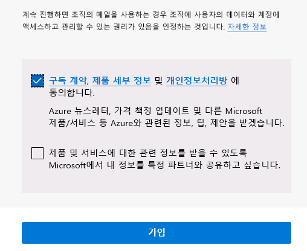

---
lab:
  title: 00 - 랩 설정
  learning path: "01"
  module: Module 01 - Implement an identity management solution
ms.openlocfilehash: c791b7ae0b00044577e88fd6e032f743bbf2788c
ms.sourcegitcommit: b5fc07c53b5663eaa1883cf38b70c57cd88470ca
ms.translationtype: HT
ms.contentlocale: ko-KR
ms.lasthandoff: 06/29/2022
ms.locfileid: "146741417"
---
# 랩 00: 랩 환경 설정

## 랩 시나리오

이어지는 랩을 완료하기 위해서는 새 Azure 구독을 만들고 Azure AD P2 라이선스를 요청해야 합니다.

#### 예상 소요 시간: 5분

## Azure 계정을 만들고 Azure Active Directory Premium P2 평가판 라이선스를 추가합니다.

연습의 작업과 학습 경로의 연습을 수행하려면 Azure 평가판 계정에 사용하거나 가입할 수 있도록 Azure를 구독해야 합니다. Azure 구독이 이미 있는 경우 이 작업을 건너뛰고 다음 작업을 계속할 수 있습니다.

1. 웹 브라우저에서 [https://azure.microsoft.com/free](https://azure.microsoft.com/free)로 이동합니다.

1. 페이지를 아래로 스크롤하여 사용 가능한 혜택 및 무료 서비스에 대해 자세히 알아보세요.

1. **체험하기** 를 선택합니다.

1. 마법사를 사용하여 Azure 평가판 구독에 가입합니다.

1. 일부 연습을 완료하려면 Azure AD P2 라이선스가 필요합니다. 직접 생성된 조직에서 **Azure Active Directory** 를 검색한 후 선택합니다.

1. 왼쪽 탐색 메뉴에서 **시작** 을 선택합니다.

1. Azure AD 시작에서 **Azure AD Premium 평가판 받기** 를 선택합니다.

1. 활성화 창의 **AZURE AD PREMIUM P2** 에서 **평가판** 을 선택하고 **활성화** 를 선택합니다.

1. 왼쪽의 탐색 메뉴에서 **개요** 를 선택합니다.

1. 조직 이름 아래에 Azure AD Premium P2가 표시될 때까지 브라우저를 새로 고칩니다. 몇 분 정도 걸릴 수 있습니다.

1. 필요한 기능을 사용할 수 없는 문제가 발생하는 경우 로그아웃하고 Microsoft Azure에 다시 로그인해야 할 수 있습니다.

#### Azure Pass 사용

1. 브라우저를 열고 [www.microsoftazurepass.com](www.microsoftazurepass.com)으로 이동합니다.

1. 모든 브라우저를 닫고 새 In-Private 브라우저 세션을 여는 것이 좋습니다. 다른 로그인은 활성화 단계 동안 지속되어 오류를 일으킬 수 있습니다.

1. **시작** 단추를 선택하여 시작합니다.

1. 사용자 이름이 랩 공급자 테넌트 계정과 같은지 확인합니다.

1. **프로모션 코드 입력** 필드에 Azure Pass 바우처 코드를 입력합니다. 

1. **프로필** 필드에 주소 정보를 입력합니다.
    - **주소란 1**: 1 Microsoft Way
    - **구/군/시**: Redmond
    - **상태**: 워싱턴
    - **우편 번호**: 98052

1. 구독 계약에 동의할 상자를 선택하고 **등록** 을 선택합니다.

    

1. [https://portal.azure.com](https://portal.azure.com)으로 이동한 후 해당 디렉터리에 대한 전역 관리자 계정을 사용하여 로그인합니다.

1. **구독** 으로 이동하여 **Azure Pass - 스폰서쉽** 이 **활성** 상태로 표시되는지 확인합니다. 
