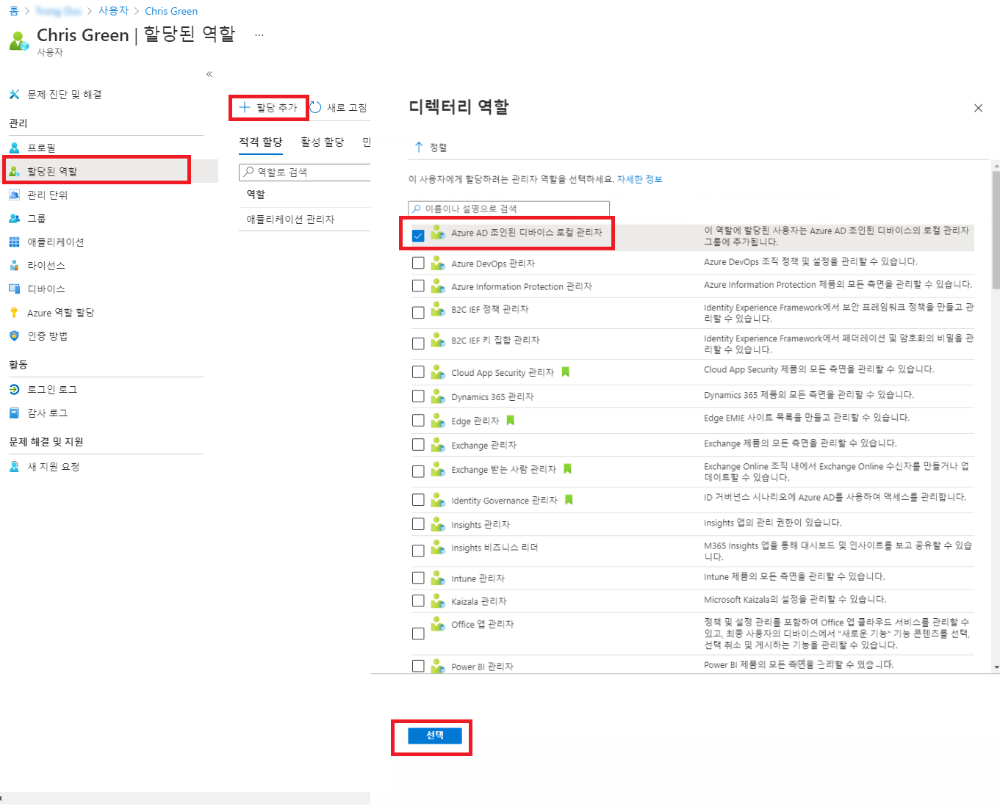
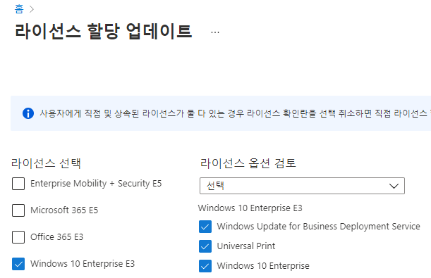

---
lab:
  title: 01 - 사용자 역할 관리
  learning path: "01"
  module: Module 01 - Implement an Identity Management Solution
ms.openlocfilehash: 9af8166d7b06f48ab62579c82dd6769a3bd89704
ms.sourcegitcommit: 6a016964eb4dcdad3685cc303453389197cd8233
ms.translationtype: HT
ms.contentlocale: ko-KR
ms.lasthandoff: 07/22/2022
ms.locfileid: "147400405"
---
# <a name="lab-01-manage-user-roles"></a>랩 01: 사용자 역할 관리

## <a name="lab-scenario"></a>랩 시나리오

귀사는 최근에 애플리케이션 관리자 업무를 맡을 새로운 직원을 채용했습니다. 새로운 사용자를 생성하고 적절한 역할을 할당해야 합니다.

#### <a name="estimated-time-30-minutes"></a>예상 소요 시간: 30분

### <a name="exercise-1---create-a-new-user-and-test-their-application-admin-rights"></a>연습 1 - 새 사용자를 만들어 애플리케이션 관리자 권한 테스트

#### <a name="task-1---add-a-new-user"></a>작업 1 - 새 사용자 추가

1. 전역 관리자로 [https://portal.azure.com](https://portal.azure.com)에 로그인합니다.

2. **Azure Active Directory** 를 검색한 후 선택합니다.

3. 왼쪽 탐색 메뉴의 **관리** 에서 **사용자** 를 선택한 다음, **+ 새 사용자** 를 선택합니다.

4. 사용자 만들기가 선택되어 있는지 확인합니다.  다음 정보를 사용하여 사용자를 생성합니다.

    | **설정**| **값**|
    | :--- | :--- |
    | 사용자 이름| ChrisG|
    | 이름| Chris Green|
    | 이름| Chris|
    | 성| 녹색|

5. **암호 직접 만들기** 를 선택합니다.

6. 암호 사용 - **기억할 수 있는 보안 암호를 입력합니다.**

     이 계정에 처음 로그인할 때 암호를 변경해야 합니다.

7. **만들기** 를 선택합니다. 이제 사용자가 만들어지고 조직에 등록됩니다.

#### <a name="task-2---login-and-try-to-create-an-app"></a>작업 2 - 로그인하여 앱 만들기 시도

1. 새 InPrivate 브라우저 창을 시작합니다.
2. Azure Portal [https://portal.azure.com](https://portal.azure.com)을 Chris Green으로 엽니다.

    | **설정**| **값**|
    | :--- | :--- |
    | 사용자 이름| ChrisG@`your domain name.com`|
    | 암호| Pass@word1|

3. 암호를 업데이트합니다.

    | **설정**| **값**|
    | :--- | :--- |
    | 현재 암호| Pass@word1|
    | 새 암호| Pa$$w.rd1234|
    | 암호 확인| Pa$$w.rd1234|

4. **Microsoft Azure 시작** 둘러보기 대화 상자가 표시되면 **나중에** 단추를 선택합니다.

5. 화면 위쪽의 검색 대화 상자에서 **엔터프라이즈 애플리케이션** 을 검색하여 선택합니다.
7. **+ 새 애플리케이션** 을 선택합니다. **+ 사용자 고유의 애플리케이션 만들기** 를 사용할 수 없습니다.

9. **애플리케이션 프록시**, **사용자 설정** 등의 기타 설정을 몇 가지 선택해 보고 **Chris Green** 에게 해당 설정을 사용할 권한이 없음을 확인합니다.
10. 오른쪽 위에서 사용자 이름인 **ChrisG** 를 선택하여 로그아웃합니다.


### <a name="exercise-2---assign-the-application-admin-role-and-create-an-app"></a>연습 2 - 애플리케이션 관리자 역할을 할당하고 앱 만들기

#### <a name="task-1---assign-a-role-to-a-user"></a>작업 1 - 사용자에게 역할 할당

Azure AD(Azure Active Directory)를 사용하면 제한된 관리자가 권한이 적은 역할로 ID 작업을 관리하도록 지정할 수 있습니다. 사용자 추가 또는 변경, 관리 역할 할당, 사용자 암호 재설정, 사용자 라이선스 관리, 도메인 이름 관리 등의 목적으로 관리자를 할당할 수 있습니다.

1. 전역 관리자 역할로 아직 로그인하지 않은 경우 Azure Portal을 열어서 로그인합니다.
2. Azure Active Directory 페이지로 이동합니다.
3. 메뉴의 관리 섹션에서 **사용자** 를 선택합니다.
4. **Chris Green** 계정을 선택합니다.
5. 관리 메뉴에서 **할당된 역할** 을 선택합니다.
6. **+ 할당 추가** 를 선택하고 `Application administrator` 역할을 표시합니다.
7. **추가** 를 선택합니다.

    

**참고** - 랩 환경이 이미 Azure AD Premium P2를 활성화한 경우 PIM(Privileged Identity Management)이 사용하도록 설정되고 **다음** 을 선택하고 이 사용자에게 영구 역할을 할당해야 합니다.

8. **새로 고침** 단추를 선택합니다.

**참고 - 새로 할당된 애플리케이션 관리자 역할이 사용자의 할당된 역할 페이지에 표시됩니다.**

#### <a name="task-2---check-application-permissions"></a>작업 2 - 애플리케이션 권한 확인

1. 새 InPrivate 브라우저 창을 시작합니다.
2. Azure Portal [https://portal.azure.com](https://portal.azure.com)을 Chris Green으로 엽니다.

    | **설정**| **값**|
    | :--- | :--- |
    | 사용자 이름| ChrisG@`your domain name.com`|
    | 암호| Pa$$w.rd1234|

3. **Microsoft Azure 시작** 둘러보기 대화 상자가 표시되면 **나중에** 단추를 선택합니다.
4. 화면 위쪽의 검색 대화 상자에서 **엔터프라이즈 애플리케이션** 을 검색하여 선택합니다.
5. 이제 **+ 새 애플리케이션** 이 사용할 수 있는 상태임을 확인합니다.
6. **+ 새 애플리케이션** 선택

   **참고 - 이제 이 역할은 테넌트에 애플리케이션을 추가할 수 있습니다.  이어지는 랩에서 이 기능을 더 사용해 볼 예정입니다.**

7. Azure Portal의 Chris Green 인스턴스에서 로그아웃하고 브라우저를 닫습니다.

### <a name="exercise-3---remove-a-role-assignment"></a>연습 3 - 역할 할당 제거

#### <a name="task-1---remove-the-application-administrator-from-chris-green"></a>작업 1 - Chris Green의 애플리케이션 관리자 역할 제거

이 작업에서는 다른 방법을 사용하여 할당된 역할을 제거합니다. 구체적으로는 Azure AD의 **역할 및 관리자** 옵션을 사용합니다.

1. 전역 관리자로 아직 로그인하지 않은 경우 지금 Azure Portal을 시작하여 로그인합니다.
2. 검색 상자에 **Azure Active Directory** 를 입력하여 Azure AD를 시작합니다.
3. **Azure Active Directory** 에서 **역할 및 관리자** 를 선택하고 목록에서 **애플리케이션 관리자** 역할을 선택합니다.

**참고** - 랩 환경이 이미 Azure AD Premium P2를 활성화한 경우 PIM(Privileged Identity Management)이 사용하도록 설정되고 **다음** 을 선택하고 이 사용자에게 영구 역할을 할당해야 합니다.

4. **애플리케이션 관리자 | 할당** 페이지에는 Chris Green의 이름이 나열되어 있습니다.
5. Chris Green 옆의 체크박스를 선택하여 확인 표시를 합니다.
6. 대화 상자 위쪽의 옵션에서 **X 할당 제거** 를 선택합니다.
7. 확인 상자가 열리면 대답으로 **예** 를 선택합니다.
8. Azure Active Directory를 닫습니다.

### <a name="exercise-4---bulk-import-of-users"></a>연습 4 - 사용자 대량 가져오기

#### <a name="task-1---bulk-operations-for-creating-users-with-a-csv-file"></a>작업 1 - .csv 파일을 사용하여 사용자를 만들기 위한 대량 작업

1. Azure AD 메뉴에서 **관리** 에서 **사용자** 를 선택합니다.

2. **사용자 | 모든 사용자** 타일에서 **대량 작업** 드롭다운 화살표를 선택한 다음, **대량 만들기** 를 선택합니다.

3. **대량 만들기** 를 선택하면 새 타일이 열립니다. 이 타일은 사용자 정보로 채우고 업로드하여 사용자 대량 생성을 추가하기 위해 편집할 템플릿 파일에 대한 **다운로드** 링크를 제공합니다.

4. **다운로드** 를 선택하여 .csv 파일을 다운로드합니다.

5. .csv 템플릿은 사용자 프로필에 포함된 필드를 제공합니다. 여기에는 필요한 사용자 이름, 표시 이름, 초기 암호가 포함됩니다. 현재 부서 및 사용 위치와 같은 선택적 필드를 완료할 수도 있습니다. 다음 스크린샷은 .csv 파일을 완료하는 방법의 예입니다. 

    

    이 파일을 수정하여 사용자를 대량으로 추가할 수 있습니다.  모든 필드를 채울 필요는 없습니다.  제공된 샘플 데이터에 따라 주로 이름 및 사용자 이름 정보를 추가해야 합니다.

6. 샘플 CSV가 Allfiles/Lab1 폴더(**SC300BulkUser.csv**)에 제공되었습니다.
   1. 메모장을 엽니다.
   2. SC300BulkUser.csv 파일 열기
   3. **도메인 이름 입력** 을 Azure 랩 환경의 도메인으로 변경합니다.
   4. 파일을 저장합니다.

7. **사용자 대량 만들기** 대화 상자의 3단계에서 파일 폴더 아이콘을 선택합니다.

8. Allfiles/Lab1 폴더의 경로를 선택하고 **SC300BulkUser.csv** 파일을 선택합니다.

9. **열기** 를 선택합니다.

7. 파일이 성공적으로 업로드되었다는 알림이 표시됩니다.  **제출** 을 선택하여 사용자를 추가합니다. 

사용자를 만든 후에는 만들기가 성공했다는 메시지가 표시됩니다.  사용자 대량 만들기 타일을 닫으면 새 사용자가 **사용자 | 모든 사용자** 목록에 채워집니다. 

#### <a name="task-2---bulk-addition-of-users-using-powershell"></a>작업 2 - PowerShell을 사용하여 사용자 대량 추가

1. 관리자 권한으로 PowerShell을 엽니다.  이 작업은 Windows에서 PowerShell을 검색하고 관리자 권한으로 실행을 선택하여 수행할 수 있습니다. 

**참고** - PowerShell ISE가 아닌 PowerShell을 선택합니다.

2. 이전에 사용하지 않은 경우 Azure AD PowerShell 모듈을 추가해야 합니다.  명령 실행: Install-Module AzureAD.  계속할지 묻는 메시지가 표시되면 “Y”를 선택하여 계속합니다.

    ```
    Install-Module AzureAD
    ```

3. 다음 명령을 실행하여 모듈이 올바르게 설치되었는지 확인합니다.  

    ```
    Get-Module AzureAD 
    ```

4. 다음으로, 다음을 실행하여 Azure에 로그인해야 합니다.  

    ```
    Connect-AzureAD 
    ``` 

5. Azure AD에 로그인할 수 있는 Microsoft 로그인 창이 나타납니다.  

6. 연결되어 있는지 확인하고 기존 사용자를 보려면 다음을 실행합니다.  

    ``` 
    Get-AzureADUser 
    ```
    
7. 모든 새 사용자에게 공통 임시 암호를 할당하려면 다음 명령을 실행하고 TempPW를 사용자에게 제공하려는 암호로 바꿉니다.  

    ``` 
    $PasswordProfile = New-Object -TypeName Microsoft.Open.AzureAD.Model.PasswordProfile
    ```

    ```
    $PasswordProfile.Password = "Pass@word1" 
    ```

8. 새 사용자를 만들 준비가 완료되었습니다.  다음 명령은 사용자 정보로 채워지고 실행됩니다.  추가할 사용자가 두 명 이상인 경우 메모장 txt 파일을 사용하여 사용자 정보를 추가하고 PowerShell에 복사/붙여넣을 수 있습니다. 

    ```
    New-AzureADUser -DisplayName "New User" -PasswordProfile $PasswordProfile -UserPrincipalName "NewUser@labtenantname.com" -AccountEnabled $true -MailNickName "Newuser"
    ```
**참고** - **labtenantname.com** 을 랩 테넌트에서 할당한 **onmicrosoft.com** 이름으로 바꿉니다.

## <a name="experiment-with-managing-users"></a>사용자 관리 작업 시도

Azure AD 페이지에서 사용자를 추가하고 제거할 수 있습니다.  스크립트를 사용하여 사용자를 만들고 역할을 할당할 수도 있습니다.  스크립트를 사용하여 Chris Green 사용자 계정에 다른 역할을 제공해 보세요. 
 

### <a name="exercise-5---remove-a-user-from-azure-active-directory"></a>연습 5 - Azure Active Directory에서 사용자 제거

#### <a name="task-1---remove-a-user"></a>작업 1 - 사용자 제거

계정이 삭제되어 복구가 필요한 경우가 발생할 수도 있습니다. 최근에 삭제된 계정을 복구할 수 있는지 확인해야 합니다.

1. [https://portal.azure.com/#blade/Microsoft_AAD_IAM/ActiveDirectoryMenuBlade/Overview]( https://portal.azure.com/#blade/Microsoft_AAD_IAM/ActiveDirectoryMenuBlade/Overview) 으로 이동합니다.

2. 왼쪽 탐색 영역의 **관리** 에서 **사용자** 를 선택합니다.

3. **사용자** 목록에서 삭제할 사용자의 확인란을 선택합니다. 예를 들어 **Chris Green** 을 선택합니다.

    **팁** - 목록에서 사용자를 선택하면 여러 사용자를 동시에 관리할 수 있습니다. 사용자를 선택하는 경우 해당 사용자의 페이지를 열려면 개별 사용자만 관리하면 됩니다.

    

4. 사용자 계정이 선택된 상태의 메뉴에서 **삭제** 를 선택합니다.

5. 대화 상자를 검토한 다음, **예** 를 선택합니다.

#### <a name="task-2---restore-a-deleted-user"></a>작업 2 - 삭제된 사용자 복원

1. 사용자 페이지의 왼쪽 탐색 영역에서 **삭제된 사용자** 를 선택합니다.

2. 삭제된 사용자 목록을 검토하고 **Chris Green** 을 선택합니다.

    **중요** - 기본적으로 삭제된 사용자 계정은 30일 후 자동으로 Azure Active Directory에서 영구히 제거됩니다.

3. 메뉴에서 **사용자 복원** 을 선택합니다.

4. 대화 상자를 검토한 다음 **확인** 을 선택합니다.

5. 왼쪽 탐색 영역에서 **모든 사용자** 를 선택합니다.

6. 사용자가 복원되었는지 확인합니다.


### <a name="exercise-6---add-a-windows-10-license-to-a-user-account"></a>연습 6 - 사용자 계정에 Windows 10 라이선스 추가

#### <a name="task-1---find-your-unlicensed-user-in-azure-active-directory"></a>작업 1 - Azure Active Directory에서 사용이 허가되지 않은 사용자 찾기

조직 내 일부 사용자 계정에서 할당된 라이선스에 포함된 모든 사용 가능 제품이 제공되지 않거나, 라이선스 할당에 대한 업데이트나 추가가 필요합니다. Azure AD에서 사용자 계정의 라이선스 할당을 업데이트할 수 있는지 확인해야 합니다.

1. [https://portal.azure.com/#blade/Microsoft_AAD_IAM/ActiveDirectoryMenuBlade/Overview]( https://portal.azure.com/#blade/Microsoft_AAD_IAM/ActiveDirectoryMenuBlade/Overview) 으로 이동합니다.

2. 왼쪽 탐색 영역의 **관리** 에서 **사용자** 를 선택합니다.

3. 사용자 페이지에서 검색 상자에 **Raul** 을 입력합니다.

4. **Raul Razo** 를 선택합니다.

5. Raul의 프로필을 검토하여 사용 위치가 설정되어 있음을 확인합니다.

    **경고** - 라이선스를 할당하려는 사용자에게는 사용 위치가 할당되어 있어야 합니다.

6. 왼쪽 메뉴에서 **라이선스** 메뉴를 선택합니다.

7. Raul에게 “라이선스 할당을 찾을 수 없습니다.”라는 메시지가 표시되는지 확인합니다.

8. [https://portal.azure.com/#blade/Microsoft_AAD_IAM/ActiveDirectoryMenuBlade/Overview]( https://portal.azure.com/#blade/Microsoft_AAD_IAM/ActiveDirectoryMenuBlade/Overview) 으로 이동합니다.

9. 왼쪽 탐색 영역의 **관리** 에서 **사용자** 를 선택합니다.

10. 사용자 페이지에서 **Raul Razo** 를 선택합니다.

11. 왼쪽 탐색 영역에서 **라이선스** 를 선택합니다.

12. **+ 할당** 단추를 선택합니다. 

13. 라이선스 할당 업데이트 페이지에서 **Windows 10/11 Enterprise E3** 라이선스의 체크박스를 선택합니다.

    

14. 완료되면 **저장** 을 선택합니다.

15. 화면 위쪽에서 **홈** 을 선택한 다음, **Contoso** 를 선택한 다음, **사용자** 를 선택하고, **Raul Razo** 를 선택합니다.

16. 라이선스가 할당되었음을 확인합니다.
