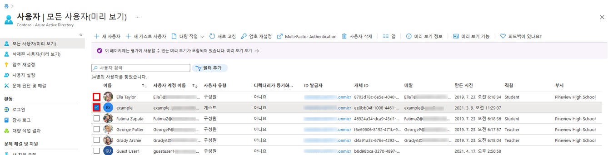

---
lab:
  title: 01 - 사용자 역할 관리
  learning path: '01'
  module: Module 01 - Implement an Identity Management Solution
---

# WWL 테넌트 - 사용 약관
강사 진행 교육 제공의 일부로 테넌트를 제공하는 경우, 강사 진행 교육에서 실습 랩을 지원하기 위해 테넌트를 사용할 수 있습니다. 테넌트를 실습 랩 외부에서 공유하거나 사용해서는 안 됩니다. 이 과정에서 사용되는 테넌트는 평가판 테넌트이며 클래스가 종료된 후 사용하거나 액세스할 수 없으며 확장판에서도 사용할 수 없습니다. 테넌트를 유료 구독으로 변환해서는 안 됩니다. 이 과정의 일부로 얻은 테넌트는 Microsoft Corporation의 재산으로 유지되며 언제든지 액세스 권한을 획득하고 다시 소유할 수 있는 권리를 보유합니다. 


# 랩 01: 사용자 역할 관리

## 랩 시나리오

귀사는 최근에 애플리케이션 관리자 업무를 맡을 새로운 직원을 채용했습니다. 새로운 사용자를 생성하고 적절한 역할을 할당해야 합니다.

#### 예상 소요 시간: 30분

### 연습 1 - 새 사용자를 만들어 애플리케이션 관리자 권한 테스트

#### 작업 1 - 새 사용자 추가

1. 전역 관리자로 [https://entra.microsoft.com](https://entra.microsoft.com)  에 로그인합니다.

2. 왼쪽 메뉴에서 **ID**를 선택합니다.

3. 왼쪽 탐색 메뉴의 **사용자**에서 **모든 사용자**를 선택한 다음 **+ 새 사용자** 및 **새 사용자 만들기**를 선택합니다.

4. **사용자 만들기** 단추를 표시합니다. 그런 다음, 다음 정보를 사용하여 사용자를 만듭니다.

    | **설정**| **값**|
    | :--- | :--- |
    | 사용자 계정 이름| ChrisG|
    | 표시 이름| Chris Green|

5. **암호 자동 생성** 옵션을 표시합니다.

6. 다음 작업을 위해 기억할 수 있는 위치에 생성된 암호를 복사합니다.

     이 계정에 처음 로그인할 때 암호를 변경해야 합니다.

7. **검토 + 생성**를 선택합니다. 그런 다음 검토 화면에서 **만들기**를 선택합니다. 이제 사용자가 만들어지고 조직에 등록됩니다.

#### 작업 2 - 로그인하여 앱 만들기 시도

1. 새 InPrivate 브라우저 창을 시작합니다.
2. Microsoft Entra 관리 센터 [https://entra.microsoft.com](https://entra.microsoft.com)를 Chris Green으로 엽니다.

    | **설정**| **값**|
    | :--- | :--- |
    | 사용자 이름| ChrisG@`your domain name.com`|
    | 암호| 이전 작업에서 자동으로 생성된 암호를 입력합니다. |

3. 암호를 업데이트합니다.

    | **설정**| **값**|
    | :--- | :--- |
    | 현재 암호| 자동 생성된 암호 사용|
    | 새 암호| 고유하고 안전한 암호 입력 |
    | 암호 확인| 고유하고 안전한 암호 다시 입력 |

4. **둘러보기 대화 상자**가 표시되면 **나중에** 단추를 선택합니다.

5. 화면 위쪽의 검색 대화 상자에서 **엔터프라이즈 애플리케이션**을 검색하여 선택합니다.
7. **+ 새 애플리케이션**을 선택합니다. **+ 사용자 고유의 애플리케이션 만들기**를 사용할 수 없습니다.

9. **애플리케이션 프록시**, **사용자 설정** 등의 기타 설정을 몇 가지 선택해 보고 **Chris Green**에게 해당 설정을 사용할 권한이 없음을 확인합니다.
10. 오른쪽 위에서 사용자 이름인 **ChrisG**를 선택하여 로그아웃합니다.


### 연습 2 - 애플리케이션 관리자 역할을 할당하고 앱 만들기

#### 작업 1 - 사용자에게 역할 할당

Microsoft Entra ID를 사용하여 권한이 낮은 역할에서 ID 작업을 관리하도록 제한된 관리자를 지정할 수 있습니다. 사용자 추가 또는 변경, 관리 역할 할당, 사용자 암호 재설정, 사용자 라이선스 관리, 도메인 이름 관리 등의 목적으로 관리자를 할당할 수 있습니다.

1. 아직 전역 관리자 역할로 로그인하지 않은 경우 Microsoft Entra 관리 센터를 열고 로그인합니다.
2. ID로 이동한 다음 사용자 페이지를 선택합니다.
3. 메뉴의 관리 섹션에서 **모든 사용자**를 선택합니다.
4. **Chris Green** 계정을 선택합니다.
5. 관리 메뉴에서 **할당된 역할**을 선택합니다.
6. **+ 할당 추가**를 선택하고 `Application administrator` 역할을 표시합니다.
7. **추가**를 선택합니다.

    

**참고** - 랩 환경에서 이미 Microsoft Entra ID Premium P2를 활성화한 경우 PIM(Privileged Identity Management)이 사용하도록 설정되며 **다음**을 선택하고 이 사용자에게 영구 역할을 할당해야 합니다.

9.**새로 고침** 단추를 선택합니다.

**참고 - 새로 할당된 애플리케이션 관리자 역할이 사용자의 할당된 역할 페이지에 표시됩니다.**

#### 작업 2 - 애플리케이션 권한 확인

1. 새 InPrivate 브라우저 창을 시작합니다.
2. Microsoft Entra 관리 센터 [https://entra.microsoftcom](https://entra.microsoft.com)를 Chris Green으로 엽니다.

    | **설정**| **값**|
    | :--- | :--- |
    | 사용자 이름| ChrisG@`your domain name.com`|
    | 암호| 이전에 만든 고유하고 안전한 암호 입력 |

3. **Microsoft Azure 시작** 둘러보기 대화 상자가 표시되면 **나중에** 단추를 선택합니다.
4. 화면 위쪽의 검색 대화 상자에서 **엔터프라이즈 애플리케이션**을 검색하여 선택합니다.
5. 이제 **+ 새 애플리케이션**이 사용할 수 있는 상태임을 확인합니다.
6. **+ 새 애플리케이션** 선택
7. **"**+ 사용자 고유의 애플리케이션 만들기**가 회색으로 표시되지 않습니다.  갤러리 앱을 선택하면 **만들기** 단추를 사용할 수 있는 것을 볼 수 있습니다.

   **참고 - 이제 이 역할은 테넌트에 애플리케이션을 추가할 수 있습니다.  이어지는 랩에서 이 기능을 더 사용해 볼 예정입니다.**

7. 포털의 Chris Green 인스턴스에서 로그아웃하고 브라우저를 닫습니다.

### 연습 3 - 역할 할당 제거

#### 작업 1 - Chris Green의 애플리케이션 관리자 역할 제거

이 작업에서는 다른 방법을 사용하여 할당된 역할을 제거합니다. 구체적으로는 Micrisoft Entra ID의 **역할 및 관리자** 옵션을 사용합니다.

1. 전역 관리자로 아직 로그인하지 않은 경우 Microsoft Entra 관리 센터를 시작하고 지금 로그인합니다.
2. 검색 상자에 **역할**을 입력한 다음 Microsoft Entra ID 역할 및 관리를 시작합니다.
3.  **역할 및 관리자**의  **모든 역할** 목록에서 **애플리케이션 관리자** 역할을 선택합니다.
4. **애플리케이션 관리자 | 할당** 페이지에는 Chris Green의 이름이 나열되어 있습니다.
5. Chris Green 옆의 체크박스를 선택하여 확인 표시를 합니다.
6. 대화 상자 위쪽의 옵션에서 **X 할당 제거**를 선택합니다.
7. 확인 상자가 열리면 대답으로 **예**를 선택합니다.
8. 화면을 닫습니다.

### 연습 4 - 사용자 대량 가져오기

#### 작업 1 - .csv 파일을 사용하여 사용자를 만들기 위한 대량 작업

1. Microsoft Entra ID 메뉴에서 먼저 **ID**를 열고 **사용자**를 선택한 다음 **모든 사용자**를 선택합니다.

2. **사용자 | 모든 사용자** 타일에서 **대량 작업** 드롭다운 화살표를 선택한 다음, **대량 만들기**를 선택합니다.

3. **대량 만들기**를 선택하면 새 타일이 열립니다. 이 타일은 사용자 정보로 채우고 업로드하여 사용자 대량 생성을 추가하기 위해 편집할 템플릿 파일에 대한 **다운로드** 링크를 제공합니다.

4. **다운로드**를 선택하여 .csv 파일을 다운로드합니다.

5. .csv 템플릿은 사용자 프로필에 포함된 필드를 제공합니다. 여기에는 필요한 사용자 이름, 표시 이름, 초기 암호가 포함됩니다. 현재 부서 및 사용 위치와 같은 선택적 필드를 완료할 수도 있습니다. 다음 스크린샷은 .csv 파일을 완료하는 방법의 예입니다. 

    

    이 파일을 수정하여 사용자를 대량으로 추가할 수 있습니다.  모든 필드를 채울 필요는 없습니다.  제공된 샘플 데이터에 따라 주로 이름 및 사용자 이름 정보를 추가해야 합니다.

6. 샘플 CSV가 Allfiles/Lab1 폴더(**SC300BulkUser.csv**)에 제공되었습니다.
   1. 메모장을 엽니다.
     - 랩 환경 내에서 시작 단추를 선택하고 메모장을 입력합니다.  
   1. SC300BulkUser.csv 파일 열기
   1. **도메인 이름 입력**을 Azure 랩 환경의 도메인으로 변경합니다.
   1. 파일을 저장합니다.

7. **사용자 대량 만들기** 대화 상자의 3단계에서 파일 폴더 아이콘을 선택합니다.

8. Allfiles/Lab1 폴더의 경로를 선택하고 **SC300BulkUser.csv** 파일을 선택합니다.

9. **열기**를 선택합니다.

7. 파일이 성공적으로 업로드되었다는 알림이 표시됩니다.**제출**을 선택하여 사용자를 추가합니다. 

사용자를 만든 후에는 만들기가 성공했다는 메시지가 표시됩니다.  사용자 대량 만들기 타일을 닫으면 새 사용자가 **사용자 | 모든 사용자** 목록에 채워집니다. 

#### 작업 2 - PowerShell을 사용하여 사용자 대량 추가

1. 관리자 권한으로 PowerShell을 엽니다.이 작업은 Windows에서 PowerShell을 검색하고 관리자 권한으로 실행을 선택하여 수행할 수 있습니다. 

**참고** - 이 랩이 작동하려면 PowerShell 버전 7.2 이상이 필요합니다.  PowerShell이 열리면 화면 상단에 버전이 표시됩니다. 이전 버전을 실행 중인 경우 화면의 지침에 따라 https://aka.ms/PowerShell-Release?tag=7.3.9로 이동합니다. 자산 섹션까지 아래로 스크롤하고 powershell-7.3.1-win-x64.msi를 선택합니다. 다운로드가 완료되면 파일 열기를 선택합니다. 모든 기본값을 사용하여 설치합니다.

2. 이전에 사용한 적이 없다면 Microsoft.Graph PowerShell 모듈을 설치해야 합니다.  다음 두 명령을 실행하고 확인하라는 메시지가 표시되면 Y 키를 누릅니다.

    ```
    Install-Module Microsoft.Graph
    ```
3. Microsoft.Graph 모듈이 설치되어 있는지 확인합니다.

    ```
    Get-InstalledModule Microsoft.Graph
    ```
    

4. 다음으로, 다음을 실행하여 Azure에 로그인해야 합니다.  

    ```
    Connect-MgGraph -Scopes "User.ReadWrite.All"
    ``` 
    Edge 브라우저가 열리고 로그인하라는 메시지가 표시됩니다.  MOD 관리자 계정을 사용하여 연결합니다.  권한 요청을 수락합니다. 그런 다음 브라우저 창을 닫습니다.

5. 연결되어 있는지 확인하고 기존 사용자를 보려면 다음을 실행합니다.  

    ``` 
    Get-MgUser 
    ```
    
7. 모든 새 사용자에게 공통 임시 암호를 할당하려면 다음 명령을 실행하고 <Enter a complex Password>를 사용자에게 제공하려는 암호로 바꿉니다.  

    ``` 
    $PWProfile = @{
        Password = "<Enter a complex password you will>";
        ForceChangePasswordNextSignIn = $false
    }
    ```

8. 새 사용자를 만들 준비가 완료되었습니다.  다음 명령은 사용자 정보로 채워지고 실행됩니다.  추가할 사용자가 두 명 이상인 경우 메모장 txt 파일을 사용하여 사용자 정보를 추가하고 PowerShell에 복사/붙여넣을 수 있습니다. 

    ```
    New-MgUser `
        -DisplayName "New PW User" `
        -GivenName "New" -Surname "User" `
        -MailNickname "newuser" `
        -UsageLocation "US" `
        -UserPrincipalName "newuser@<labtenantname.com>" `
        -PasswordProfile $PWProfile -AccountEnabled `
        -Department "Research" -JobTitle "Trainer"
    ```
**참고** - **labtenantname.com**을 랩 테넌트에서 할당한 **onmicrosoft.com** 이름으로 바꿉니다.

## 사용자 관리 작업 시도

Microsoft Entra ID 페이지에서 사용자를 추가하고 제거할 수 있습니다.  스크립트를 사용하여 사용자를 만들고 역할을 할당할 수도 있습니다.  스크립트를 사용하여 Chris Green 사용자 계정에 다른 역할을 제공해 보세요. 
 

### 연습 5 - Microsoft Entra ID에서 사용자 제거

#### 작업 1 - 사용자 제거

계정이 삭제되어 복구가 필요한 경우가 발생할 수도 있습니다. 최근에 삭제된 계정을 복구할 수 있는지 확인해야 합니다.

1. [https://entra.micrososft.com](Microsoft Entra admin center) 으로 이동합니다.

2. 왼쪽 탐색 메뉴의 **ID**에서 **사용자**를 선택합니다.

3. **모든 사용자** 목록을 열고 삭제할 사용자의 확인란을 선택합니다. 예를 들어 **Chris Green**을 선택합니다.

    **팁** - 목록에서 사용자를 선택하면 여러 사용자를 동시에 관리할 수 있습니다. 사용자를 선택하는 경우 해당 사용자의 페이지를 열려면 개별 사용자만 관리하면 됩니다.

    

4. 사용자 계정이 선택된 상태의 메뉴에서 **삭제**를 선택합니다.

5. 대화 상자를 검토한 다음, **예**를 선택합니다.

#### 작업 2 - 삭제된 사용자 복원

1. 사용자 페이지의 왼쪽 탐색 메뉴에서 **모든 사용자**를 선택하고 **삭제된 사용자**를 선택합니다.

2. 삭제된 사용자 목록을 검토하고 **Chris Green**을 선택합니다.

    **중요** - 기본적으로 삭제된 사용자 계정은 30일 후 자동으로 Azure Active Directory에서 영구히 제거됩니다.

3. 메뉴에서 **사용자 복원**을 선택합니다.

4. 대화 상자를 검토한 다음 **확인**을 선택합니다.

5. 왼쪽 탐색 영역에서 **모든 사용자**를 선택합니다.

6. 사용자가 복원되었는지 확인합니다.


### 연습 6 - 사용자 계정에 Windows 10 라이선스 추가

#### 작업 1 - Azure Active Directory에서 사용이 허가되지 않은 사용자 찾기

조직 내 일부 사용자 계정에서 할당된 라이선스에 포함된 모든 사용 가능 제품이 제공되지 않거나, 라이선스 할당에 대한 업데이트나 추가가 필요합니다. Microsoft Entra ID에서 사용자 계정의 라이선스 할당을 업데이트할 수 있는지 확인해야 합니다.

1. [https://entra.microsoft.com]( https://entra.microsoft.com) 으로 이동합니다.

2. 왼쪽 탐색 메뉴의 **ID**에서 **사용자**를 선택한 다음 **모든 사용자**를 선택합니다.

3. 사용자 페이지에서 검색 상자에 **Raul**을 입력합니다.

4. **Raul Razo**를 선택합니다.

5. Raul의 프로필을 검토하여 사용 위치가 설정되어 있음을 확인합니다.

    **경고** - 라이선스를 할당하려는 사용자에게는 사용 위치가 할당되어 있어야 합니다.

6. 왼쪽 메뉴에서 **라이선스** 메뉴를 선택합니다.

7. Raul에게 “라이선스 할당을 찾을 수 없습니다.”라는 메시지가 표시되는지 확인합니다.

8. 왼쪽 탐색 메뉴에서 **모든 사용자**로 돌아가서 **ID** 아래에서 **사용자**를 선택합니다.

9. 사용자 페이지에서 **Raul Razo**를 선택합니다.

10. 왼쪽 탐색 영역에서 **라이선스**를 선택합니다.

11. **+ 할당** 단추를 선택합니다. 

12. 라이선스 할당 업데이트 페이지에서 **Windows 10/11 Enterprise E3** 라이선스의 체크박스를 선택합니다.

    

13. 완료되면 **저장**을 선택합니다.

14. 화면 위쪽에서 **홈**을 선택한 다음, **Contoso**를 선택한 다음, **사용자**를 선택하고, **Raul Razo**를 선택합니다.

15. 라이선스가 할당되었음을 확인합니다.
