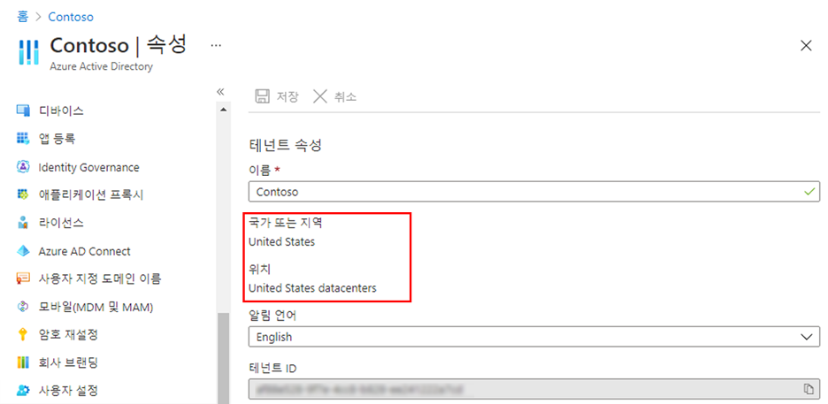
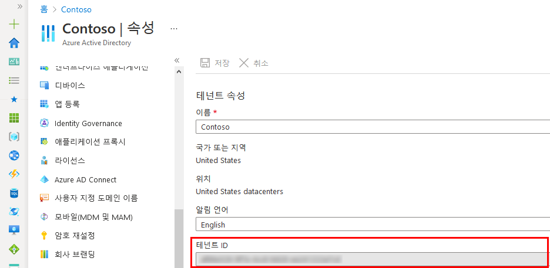
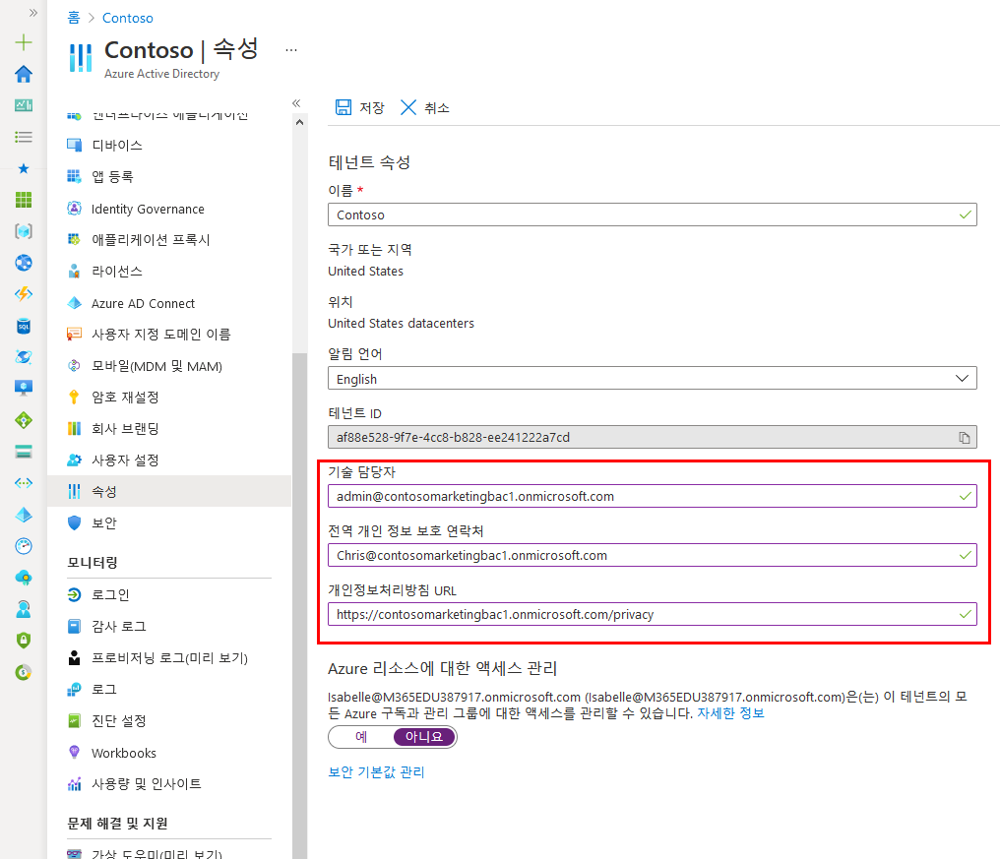
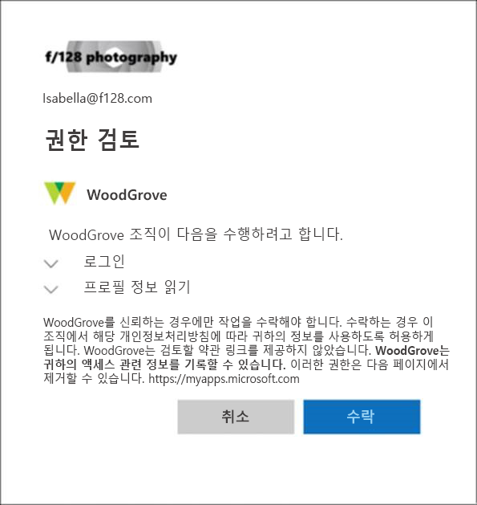

---
lab:
  title: 02 - 테넌트 속성으로 작업
  learning path: '01'
  module: Module 01 - Implement an Identity Management Solution
---

# 랩 02: 테넌트 속성 사용

## 랩 시나리오

테넌트와 연관된 다양한 속성을 식별하고 업데이트해야 합니다.

#### 예상 소요 시간: 15분

### 연습 1 - 사용자 지정 하위 도메인 만들기 

#### 작업 1 - 사용자 지정 하위 도메인 이름 만들기

1. [https://entra.microsoft.com](https://entra.microsoft.com)으로 이동한 후 해당 디렉터리에 대한 전역 관리자 계정을 사용하여 로그인합니다.

1. **ID** 메뉴에서 **설정** 메뉴를 열고 **도메인 이름**을 선택합니다.

1. **+사용자 지정 도메인 추가**를 선택합니다.

1. **사용자 지정 도메인 이름** 필드에서 **onmicrosoft.com** 도메인 이름 앞에 **판매**를 배치하여 랩 테넌트에 대한 사용자 지정 하위 도메인을 만듭니다.  형식은 다음과 유사합니다.

    ```
    sales.labtenant.onmicrosoft.com
    ```

1. **도메인 추가**를 선택하여 하위 도메인을 추가합니다.


### 연습 2 - 테넌트 표시 이름 변경

#### 작업 1 - 테넌트 이름 및 기술 담당자 설정

1. Microsoft Entra 관리 센터 내에서 **ID** 메뉴를 엽니다.

1. 왼쪽 탐색 메뉴에서 **개요** 메뉴 항목을 선택한 다음 **속성**을 선택합니다.

1. 대화 상자에서 테넌트 속성의 **이름** 및 **기술 담당자**를 변경합니다.

    | **설정** | **값** |
    | :--- | :--- |
    | Name | Contoso Marketing |
    | 기술 담당자 | `your Global admin account` |

1. **저장**을 선택하여 테넌트 속성을 업데이트합니다.

   **저장이 완료되면 이름이 즉시 변경됩니다.**

#### 작업 2 - 테넌트와 연관된 국가나 지역 및 기타 값 검토

1. **ID** 메뉴에서 **개요**를 선택한 다음 **속성**을 선택합니다.

2. **테넌트 속성**에서 **국가 또는 지역**을 찾아 정보를 검토합니다.

    **중요** - 국가나 지역은 테넌트를 만들 때 지정됩니다. 이 설정은 나중에 변경할 수 없습니다.

3. **속성** 페이지의 **테넌트 속성**에서 **위치**를 찾아서 정보를 검토합니다.

    

#### 작업 3 - 테넌트 ID 찾기

Azure 구독은 Microsoft Entra ID와 트러스트 관계가 있습니다. Microsoft Entra ID는 구독에 대한 사용자, 서비스, 디바이스를 인증하는 데 신뢰할 수 있습니다. 각 구독에는 연결된 테넌트 ID가 있으며, 구독에 대한 테넌트 ID를 찾을 수 있는 몇 가지 방법이 있습니다.

1. Microsoft Entra 관리 센터 열기 [https://entra.microsoft.com](https://entra.microsoft.com)

1. **ID** 메뉴에서 **개요**를 선택한 다음 **속성**을 선택합니다.

1. **테넌트 속성**에서 **테넌트 ID**를 찾습니다. 고유한 테넌트 식별자입니다.

    

### 연습 3 - 개인 정보 설정

#### 작업 1 - Microsoft Entra ID에 글로벌 개인 정보 연락처 및 개인정보처리방침 URL을 포함한 개인 정보 추가

전역 개인 정보 보호 연락처와 조직의 개인정보처리방침을 모두 추가하는 것이 좋습니다. 그러면 내부 직원과 외부 게스트가 정책을 검토할 수 있습니다. 개인정보처리방침이 고유하게 생성되고 각 비즈니스에 맞게 조정되기 때문에 도움말은 변호사에게 문의하는 것이 좋습니다.

   **참고** - 개인 데이터를 보거나 삭제하는 방법에 대한 자세한 내용은 [https://docs.microsoft.com/microsoft-365/compliance/gdpr-dsr-azure](https://docs.microsoft.com/microsoft-365/compliance/gdpr-dsr-azure)를 참조하세요. GDPR에 대한 자세한 내용은 [https://servicetrust.microsoft.com/ViewPage/GDPRGetStarted](https://servicetrust.microsoft.com/ViewPage/GDPRGetStarted)를 참조하세요.

Microsoft Entra ID의  **속성**  영역에 조직의 개인 정보를 추가합니다. 속성 영역에 액세스하고 개인 정보를 추가하려면:

1. **ID** 메뉴에서 **개요**를 선택한 다음 **속성**을 선택합니다.

    

2. 직원의 개인 정보를 추가합니다.

- **전역 개인 정보 보호 연락처** - `AllanD@` **Azure 랩 도메인**
     - Azure 랩 테넌트의 기본 제공 사용자인 Allan Deyoung은 IT 관리자입니다. 이 랩에서는 Allan을 개인 정보 보호 연락처로 사용합니다.
     - 이 사용자는 데이터 위반이 발생하는 경우 Microsoft에서 연락할 사람이기도 합니다. 여기에 나열된 사용자가 없는 경우 Microsoft에서는 전역 관리자에게 연락합니다.

- **개인정보처리방침 URL** -  <https://github.com/MicrosoftLearning/SC-300-Identity-and-Access-Administrator/blob/master/Allfiles/Labs/Lab2/SC-300-Lab_ContosoPrivacySample.pdf>

     - 샘플 개인 정보 PDF는 랩 디렉터리에서 제공됩니다.
     \- 조직이 내부 및 외부 게스트의 데이터 개인 정보를 모두 처리하는 방법을 설명하는 조직의 문서 링크를 입력합니다.

    **중요** - 고유한 개인정보처리방침이나 개인 정보 보호 연락처를 포함하지 않는 경우 외부 게스트는 검토 권한 상자에 “ **<조직 이름\>** 에서는 검토할 해당 약관에 대한 링크를 제공하지 않습니다”라는 텍스트를 보게 됩니다. 예를 들어 게스트 사용자는 B2B 협업을 통해 조직에 액세스하는 초대를 받을 때 이 메시지를 확인하게 됩니다.

    

3. **저장**을 선택합니다.

#### 작업 2 - 개인정보처리방침 확인

1. Azure 홈 화면 - 대시보드로 돌아옵니다.
2. UI 오른쪽 위에서 사용자 이름을 선택합니다.
3. 드롭다운 메뉴에서 **계정 보기**를 선택합니다.

     **새 브라우저 탭이 자동으로 열립니다.**

4. 왼쪽 메뉴에서 **설정 및 프라이버시**를 선택합니다.
5. **개인 정보**를 선택합니다.
6. **조직의 알림**에서 Contoso Marketing 조직 개인정보처리방침 옆의 **보기** 항목을 선택합니다.

     **새 브라우저 탭이 열리고 연결한 개인 정보 PDF 파일이 표시됩니다.**

7. 샘플 개인정보처리방침을 검토합니다.
8. PDF가 표시된 브라우저 탭을 닫습니다.
9. **내 계정** 항목이 표시된 브라우저 탭을 닫습니다.
