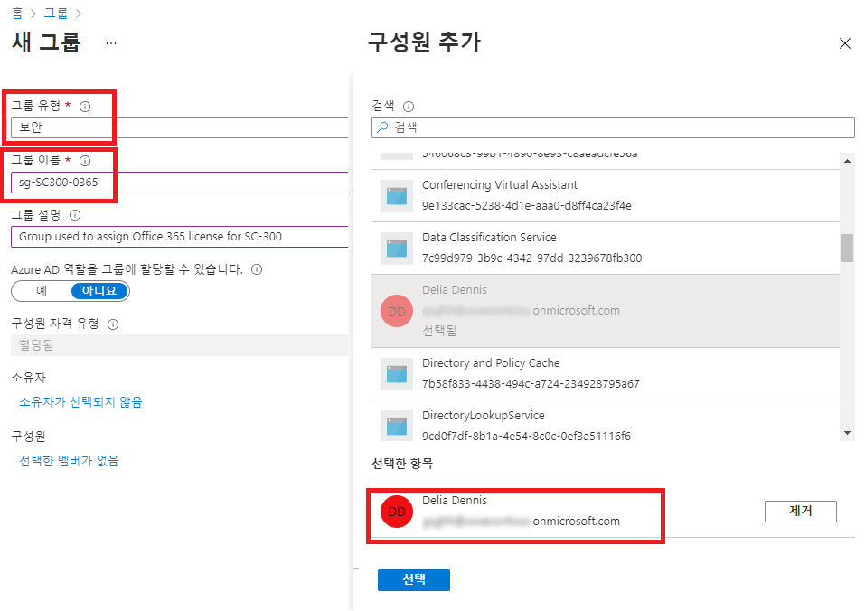

---
lab:
  title: 03 - 그룹 구성원 자격을 사용하여 라이선스 할당
  learning path: "01"
  module: Module 01 - Implement an identity management solution
ms.openlocfilehash: bf32962c7594a36532476d3af378d767ba981017
ms.sourcegitcommit: 80c5c0ef60c1d74fcc58c034fe6be67623013cc0
ms.translationtype: HT
ms.contentlocale: ko-KR
ms.lasthandoff: 07/01/2022
ms.locfileid: "146823207"
---
# <a name="lab-03-assigning-licenses-using-group-membership"></a>랩 03: 그룹 구성원 자격을 사용하여 라이선스 할당

## <a name="lab-scenario"></a>랩 시나리오

조직에서 Azure AD의 보안 그룹을 사용하여 라이선스를 관리하기로 결정했습니다. 새로운 보안 그룹을 구성하고, 해당 그룹에 라이선스를 할당하고, 그룹 구성원 라이선스가 업데이트되었는지 확인해야 합니다.

#### <a name="estimated-time-25-minutes"></a>예상 소요 시간: 25분

### <a name="exercise-1---create-a-security-group-and-add-a-user"></a>연습 1 - 보안 그룹 만들기 및 사용자 추가

#### <a name="task-1---check-to-see-if-delia-dennis-has-access-to-office-365"></a>작업 1 - Delia Dennis에게 Office 365 액세스 권한이 있는지 확인

1. 새 InPrivate 브라우저 창을 시작합니다.
2. [https://www.office.com](https://www.office.com)에 연결합니다.
3. 로그인을 선택하고 Delia Dennis로 연결합니다.

   | **설정**| **값**|
   | :--- | :--- |
   | 사용자 이름 | DeliaD@`your domain name.com`|
   | 암호| 리소스의 전역 관리자 암호 입력|

4. Office.com 웹 사이트에 연결은 되지만 라이선스가 없다는 메시지가 표시됩니다.

   
    
5. 브라우저 창을 닫습니다.

#### <a name="task-2----create-a-security-group-in-azure-active-directory"></a>작업 2 - Azure Active Directory에서 보안 그룹 만들기

1. [https://portal.azure.com/#blade/Microsoft_AAD_IAM/ActiveDirectoryMenuBlade/Overview]( https://portal.azure.com/#blade/Microsoft_AAD_IAM/ActiveDirectoryMenuBlade/Overview) 으로 이동합니다.

2. 왼쪽 탐색 영역의 **관리** 에서 **그룹** 을 선택합니다.
3. 그룹 페이지의 메뉴에서 **새 그룹** 을 선택합니다.
4. 다음 정보를 사용하여 그룹을 생성합니다.

   | **설정**| **값**|
   | :--- | :--- |
   | 그룹 형식| 보안|
   | 그룹 이름| sg-SC300-O365|
   | 멤버 자격 유형| 할당됨|
   | 소유자| *자신의 관리자 계정을 그룹 소유자로 할당*|

5. 구성원 아래에서 **선택한 멤버가 없음** 텍스트를 선택합니다.
6. 사용자 목록에서 **Delia Dennis** 를 선택합니다.
7. **선택** 단추를 누릅니다.

   

8. **생성** 단추를 선택합니다.
9. 만들기가 완료되면 **sg-SC300-O365** 그룹이 **모든 그룹** 목록에 표시되는지 확인합니다.

#### <a name="task-3---assign-a-license-to-a-group"></a>작업 3 - 그룹에 라이선스 할당

1. **모든 그룹** 목록에서 **sg-SC300-O365** 를 선택합니다.
2. Marketing 페이지의 **관리** 에서 **라이선스** 를 선택합니다.
3. 메뉴에서 **+ 할당** 을 선택합니다.
4. 라이선스 할당 업데이트 페이지의 **라이선스 선택** 에서 사용 가능한 라이선스 목록을 검토한 후 **Office 365 E3** 의 체크박스를 선택합니다.

   **팁** - 여러 라이선스를 선택한 경우 라이선스 옵션 검토 메뉴를 사용하여 특정 라이선스를 선택하고 해당 라이선스의 라이선스 옵션을 볼 수 있습니다.

   

6. **저장** 을 선택합니다.

#### <a name="taks-4---confirm-the-office-365-license"></a>작업 4 - Office 365 라이선스 확인

1. 새 InPrivate 브라우저 창을 시작합니다.
2. [https://www.office.com](https://www.office.com)에 연결합니다.
3. 로그인을 선택하고 Delia Dennis로 연결합니다.

   | **설정**| **값**|
   | :--- | :--- |
   | 사용자 이름 | DeliaD@`your domain name.com`|
   | 암호| 리소스의 전역 관리자 암호 입력|

4. Office.com 웹 사이트에 연결하여 라이선스 관련 메시지가 없는지 확인해야 합니다. 모든 Office 애플리케이션은 왼쪽에서 사용할 수 있습니다.

   
    
5. 브라우저 창을 닫습니다. 

### <a name="exercise-2---create-an-microsoft-365-group-in-azure-active-directory"></a>연습 2 - Azure Active Directory에서 Microsoft 365 그룹 만들기

#### <a name="task-1---create-the-group"></a>작업 1 - 그룹 만들기

Azure AD 관리자의 업무 중 하나는 다양한 유형의 그룹을 만드는 것입니다. 조직의 영업부를 위해 새로운 Microsoft 365 그룹을 만들어야 합니다.

1. [https://portal.azure.com/#blade/Microsoft_AAD_IAM/ActiveDirectoryMenuBlade/Overview]( https://portal.azure.com/#blade/Microsoft_AAD_IAM/ActiveDirectoryMenuBlade/Overview) 으로 이동합니다.

2. 왼쪽 탐색 영역의 **관리** 에서 **그룹** 을 선택합니다.

3. 그룹 페이지의 메뉴에서 **새 그룹** 을 선택합니다.

4. 다음 정보를 사용하여 그룹을 생성합니다.

   | **설정**| **값**|
   | :--- | :--- |
   | 그룹 형식| Microsoft 365|
   | 그룹 이름| 북서부 판매액|
   | 멤버 자격 유형| 할당됨|
   | 소유자| *자신의 관리자 계정을 그룹 소유자로 할당*|
   | 멤버| **Alex Wilber** 및 **Bianca Pisani**|

   

5. 완료되면 이름이 **Northwest sales** 라는 그룹이 **모든 그룹** 목록에 표시되는지 확인합니다.

### <a name="exercise-3---creating-a-dynamic-group-with-all-users-as-members"></a>연습 3 - 모든 사용자를 구성원으로 사용하여 동적 그룹 만들기

#### <a name="task-1---create-the-dynamic-group"></a>작업 1 - 동적 그룹 만들기

회사가 성장함에 따라 수동으로 그룹을 관리하는 것은 시간이 너무 오래 걸릴 수 있습니다. 디렉터리를 표준화한 이후에는 동적 그룹을 활용할 수 있습니다. 실제로 동적 그룹을 생성할 준비가 되었는지 확인하기 위해 새로운 동적 그룹을 만들어봐야 합니다.

1. 테넌트에서 전역 관리자 또는 사용자 관리자 역할이 할당된 계정으로 [https://portal.azure.com](https://portal.azure.com)에 로그인합니다.

2. **Azure Active Directory** 를 선택합니다.

3. **관리** 에서 **그룹** 을 선택한 다음 **새 그룹** 을 선택합니다.

4. 새 그룹 페이지의 **그룹 종류** 에서 **보안** 을 선택합니다.

5. **그룹 이름** 상자에 **SC300-myDynamicGroup** 을 입력합니다.

6. **구성원 자격 유형** 메뉴를 선택하고 **동적 사용자** 를 선택합니다.

7. 그룹의 **소유자** 를 선택합니다.

7. **동적 사용자 구성원** 에서 **동적 쿼리 추가** 를 선택합니다.

8. **규칙 구문** 상자 오른쪽 위에 있는 **편집** 을 선택합니다.

9. 규칙 구문 편집 창에서 **규칙 구문** 상자에 다음 식을 입력합니다.

   ```powershell
   user.objectid -ne null
   ```

   **경고** - `user.objectid`는 대/소문자를 구분합니다.

10. **확인** 을 선택합니다. 규칙은 규칙 구문 상자에 나타납니다.

   

11. **저장** 을 선택합니다. 새 동적 그룹에는 이제 구성원 사용자뿐만 아니라 B2B 게스트 사용자도 포함됩니다.

12. 새 그룹 페이지에서 **생성** 를 선택하여 그룹을 생성합니다.

#### <a name="task-2---verify-the-members-have-been-added"></a>작업 2 - 구성원이 추가되었는지 확인

**참고** - 동적 그룹 멤버 자격의 모집단은 최대 15분이 걸릴 수 있습니다.

1. **홈** `Azure Active Directory`에서 선택합니다.
2. **Azure Active Directory** 를 시작합니다.
3. **관리** 메뉴에서 **그룹** 을 선택합니다.
4. 필터 상자에 **SC300** 을 입력하면 새로 만든 그룹이 목록에 표시됩니다.
5. **SC300-myDynamicGroup** 을 선택하여 그룹을 엽니다.
6. 그룹의 *직접 구성원 수가 30명이 넘는다는 메시지가 표시됩니다.
7. **관리** 메뉴에서 **구성원** 을 선택합니다.
8. 구성원을 검토합니다.

#### <a name="task-3---experiment-with-alternate-rules"></a>작업 3 - 다른 규칙 사용해 보기

1. **게스트** 사용자만 포함된 그룹을 만들어 봅니다.

   - (user.objectid -ne null) 및 (user.userType -eq "Guest") 식을 사용하면 됩니다.

2. Azure AD 사용자의 **구성원** 만 포함된 그룹을 만들어 봅니다.

   - (user.objectid -ne null) 및 (user.userType -eq "Member") 식을 사용하면 됩니다.
