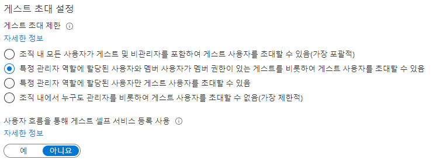

---
lab:
  title: 04 - 외부 협업 설정 구성
  learning path: "01"
  module: Module 01 - Implement an identity management solution
ms.openlocfilehash: 1980b26735b55bc06edfb356ec03f34ba221afb9
ms.sourcegitcommit: b5fc07c53b5663eaa1883cf38b70c57cd88470ca
ms.translationtype: HT
ms.contentlocale: ko-KR
ms.lasthandoff: 06/29/2022
ms.locfileid: "146741668"
---
# 랩 04: 외부 협업 설정 구성

## 랩 시나리오

승인된 게스트 액세스에 대해 조직의 외부 협업 설정을 활성화해야 합니다.

#### 예상 소요 시간: 5분

### 연습 1 - 조직에 게스트 사용자 초대 허용

#### 작업 - 외부 협업 설정 구성

1. [https://portal.azure.com](https://portal.azure.com)에 테넌트 관리자로 로그인합니다.
2. **Azure Active Directory** 를 선택합니다.
3. **외부 ID > 외부 협업 설정** 을 선택합니다.
4. 화면 위쪽에 표시되는 **일회용 암호 메일 전송** 알림 링크를 선택합니다.

    **참고** - 일회용 암호를 사용하면 매우 안전한 방식으로 사용자를 조직에 초대할 수 있습니다.

5. `Home > Contoso Marketing >` **외부 ID** 를 선택하여 이전 화면으로 돌아갑니다.
6. 왼쪽에서 **외부 협업 설정** 을 선택합니다.

7. **게스트 사용자 액세스** 에서 사용 가능한 액세스 수준을 검토한 다음 **게스트 사용자 액세스는 고유한 디렉터리 개체의 속성 및 멤버 자격으로 제한됩니다(가장 제한적)** 를 선택합니다.

    **참고**
    - 게스트 사용자는 멤버와 동일한 액세스 권한을 갖습니다(가장 포괄적): 이 옵션은 게스트에게 Azure AD 리소스와 디렉터리 데이터에 대한 액세스 권한을 구성원 사용자와 동일하게 제공합니다.
    - 게스트 사용자의 액세스는 디렉터리 개체의 속성 및 멤버 자격으로 제한됩니다. (기본값) 이 설정은 사용자, 그룹 또는 기타 디렉터리 리소스를 열거하는 등의 특정 디렉터리 작업에서 게스트를 차단합니다. 게스트가 숨겨지지 않은 모든 그룹의 구성원 자격을 볼 수 있습니다.
    - 게스트 사용자 액세스는 고유한 디렉터리 개체의 속성 및 멤버 자격으로 제한됩니다(가장 제한적): 이 설정을 사용하면 게스트가 자신의 프로필에만 액세스할 수 있습니다. 게스트는 다른 사용자의 프로필, 그룹 또는 그룹 구성원 자격을 볼 수 없습니다.

    

8. **게스트 초대 설정** 에서 **특정 관리자 역할에 할당된 멤버 사용자가 멤버 사용 권한을 가진 게스트를 비롯한 게스트 사용자를 초대할 수 있음** 을 선택합니다.

    **참고**
    - 조직 내 모든 사용자가 게스트 및 비관리자를 포함하여 게스트 사용자를 초대할 수 있음(가장 포괄적) : 조직의 게스트가 조직의 구성원이 아닌 사용자를 포함하는 다른 게스트를 초대하도록 허용하려면 이 라디오 단추를 선택합니다.
    - 특정 관리자 역할에 할당된 사용자와 멤버 사용자가 멤버 권한이 있는 게스트를 비롯하여 게스트 사용자를 초대할 수 있음: 구성원인 사용자와 특정 관리자 역할이 있는 사용자가 게스트를 초대할 수 있도록 허용하려면 이 라디오 단추를 선택합니다.
    - 특정 관리자 역할에 할당된 사용자만 게스트 사용자를 초대할 수 있음: 관리자 역할이 있는 사용자만 게스트를 초대하도록 허용하려면 이 라디오 단추를 선택합니다. 관리자 역할에는 전역 관리자, 사용자 관리자 및 게스트 초대자가 포함됩니다.
    - 조직 내에서 누구도 관리자를 비롯하여 게스트 사용자를 초대할 수 없음(가장 제한적) : 조직의 모든 사람이 게스트를 초대하는 것을 거부하려면 이 라디오 단추를 선택합니다.
    - 구성원이 초대할 수 있음을 아니요로 설정하고 관리자 및 게스트 초대자 역할의 사용자가 초대할 수 있음을 예로 설정한 경우 게스트 초대자 역할의 사용자가 게스트를 계속 초대할 수 있습니다.

    

9. **협업 제한** 에서 사용 가능한 옵션을 검토하고 기본 설정을 적용합니다.

    **중요**
    - 허용 목록 또는 거부 목록을 만들 수 있습니다. 두 목록을 모두 설정할 수는 없습니다. 기본적으로 허용 목록에 없는 모든 도메인은 거부 목록에 있게 되고 반대의 경우도 마찬가지가 됩니다.
    - 조직당 하나의 정책만 만들 수 있습니다. 더 많은 도메인을 포함하도록 정책을 업데이트하거나 정책을 삭제하고 새 정책을 만들 수도 있습니다.
    - 허용 목록 또는 거부 목록에 추가할 수 있는 도메인 수는 정책 크기에 의해서만 제한됩니다. 전체 정책의 최대 크기는 25KB(25000자)입니다. 여기에는 허용 목록 또는 거부 목록과 다른 기능에 대해 구성 된 기타 매개 변수가 포함됩니다.
    - 이 목록은 OneDrive for Business 및 SharePoint Online 허용/차단 목록과는 독립적으로 적용됩니다. SharePoint Online에서의 개별 파일 공유를 제한하려면 OneDrive for Business 및 SharePoint Online에 대한 허용 또는 거부 목록을 설정해야 합니다.
    - 이 목록은 이미 초대를 사용한 외부 사용자에게는 적용되지 않습니다. 목록은 설정한 후에 시행됩니다. 사용자 초대가 대기 상태이며 해당 도메인을 차단하는 정책을 설정한 경우 해당 사용자가 초대를 사용하려 하면 실패하게 됩니다.

10. 완료되면 변경 내용을 **저장** 합니다.
