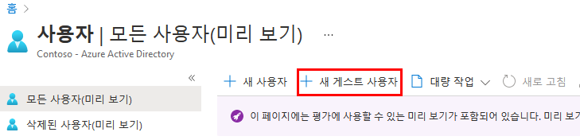
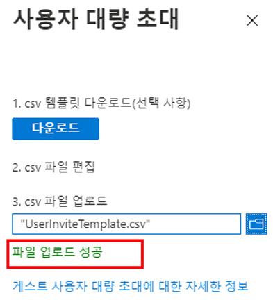

---
lab:
  title: 05 - 디렉터리에 게스트 사용자 추가
  learning path: "01"
  module: Module 01 - Implement an identity management solution
ms.openlocfilehash: 48a24758034e463192f9f726b223dce1b961bb76
ms.sourcegitcommit: b5fc07c53b5663eaa1883cf38b70c57cd88470ca
ms.translationtype: HT
ms.contentlocale: ko-KR
ms.lasthandoff: 06/29/2022
ms.locfileid: "146741723"
---
# <a name="lab-05-add-guest-users-to-the-directory"></a>랩 05: 디렉터리에 게스트 사용자 추가

## <a name="lab-scenario"></a>랩 시나리오

귀사는 여러 공급업체와 협력하고 있으며, 때로는 일부 공급업체 계정을 디렉터리에 게스트로 추가해야 합니다.

#### <a name="estimated-time-20-minutes"></a>예상 소요 시간: 20분

### <a name="exercise-1---add-guest-users-to-the-directory"></a>연습 1 – 디렉터리에 게스트 사용자 추가

#### <a name="task---add-the-guest-user"></a>작업 - 게스트 사용자 추가

1. 제한된 관리자 디렉터리 역할 또는 게스트 초대자 역할에 할당된 사용자로 [https://portal.azure.com](https://portal.azure.com)에 로그인합니다.

2. **Azure Active Directory** 를 선택합니다.

3. **관리** 에서 **사용자** 를 선택합니다.

4. **새 게스트 사용자** 를 선택합니다.

    

5. 새 사용자 페이지에서 **사용자 초대** 를 선택하고 자신의 정보를 게스트 사용자 정보로 추가합니다.

    >**참고** - 그룹 메일 주소는 지원되지 않습니다. 개인용 메일 주소를 입력하세요. 또한 일부 이메일 공급 기업에서는 수신함 필터링 등을 지원하기 위해 사용자가 이메일 주소에 더하기 기호(+) 및 추가 텍스트를 추가하는 것을 허용합니다. 그러나 Azure AD는 현재 메일 주소에서 더하기 기호를 지원하지 않습니다. 배달 문제를 방지하려면 @ 기호 뒤에 오는 모든 문자 및 더하기 기호를 생략합니다.

6. 메일 주소(예: **sc300externaluser1@sc300email.com** )를 입력합니다.

7. 완료되면 **초대** 를 선택합니다.

8. 사용자 페이지에서 내 계정이 나열되어 있는지 확인하고 **사용자 유형** 열에서 **게스트** 가 표시되는지 확인합니다.

초대를 발송한 후 사용자 계정이 디렉터리에 게스트로 자동 추가됩니다.


### <a name="exercise-2---invite-guest-users-in-bulk"></a>연습 2 – 게스트 사용자 대량 초대

#### <a name="task-1---bulk-user-invite"></a>작업 1 - 사용자 대량 초대

최근에 다른 회사와의 파트너십이 체결되었습니다. 일단은 파트너 회사의 직원들이 게스트로 추가될 것입니다. 여러 게스트 사용자를 한 번에 가져올 수 있는지 확인해야 합니다.

1. 전역 관리자로 [https://portal.azure.com](https://portal.azure.com)에 로그인합니다.

2. 탐색 창에서 **Azure Active Directory** 를 선택합니다.

3. **관리** 에서 **사용자** 를 선택합니다.

4. 사용자 페이지의 메뉴에서 **대량 작업 > 대량 초대** 를 선택합니다.

     

5. 대량 초대 사용자 창에서 초대 속성을 사용하여 샘플 CSV 템플릿으로 **다운로드** 를 선택합니다.

6. 편집기를 사용하여 CSV 파일을 보려면 템플릿을 검토합니다.

7. .csv 템플릿을 열고 각 게스트 사용자에 대한 줄을 추가합니다. 필요한 값은 다음과 같습니다.

    - **초대할 이메일 주소** - 초대를 받을 사용자
    - **리디렉션 URL** - 초대를 승인한 후 초대된 사용자가 전달되는 URL.

    

8. 파일을 저장합니다.

9. 사용자 일괄 초대 페이지의 **csv 파일 업로드** 에서 해당 파일을 찾습니다.

     **참고** - 파일을 선택하면 .csv 파일의 유효성 검사가 시작됩니다.

10. 파일 내용의 유효성을 검사한 후에 **파일이 업로드** 된 것을 확인할 수 있습니다. 오류가 있는 경우 해당 오류를 해결해야 작업을 제출할 수 있습니다.

    

11. 파일이 유효성 검사를 통과하면 **제출** 을 선택하여 초대를 추가하는 Azure 대량 작업을 시작합니다.

12. 작업 상태를 보려면 **각 작업의 상태를 보려면 여기를 선택** 을 선택합니다. 또는 작업 섹션에서 **대량 작업 결과** 를 선택할 수 있습니다. 대량 작업 내의 각 줄 항목에 대한 자세한 내용을 보려면 **# Success**, **# Failure** 또는 **Total Requests** 열의 값을 선택합니다. 오류가 발생하면 실패 이유가 나열됩니다.

    

13. 작업이 완료 되 면 대량 작업이 성공했다는 알림이 표시됩니다.

#### <a name="task-2---invite-guest-users-with-powershell"></a>작업 2 - PowerShell을 사용하여 게스트 사용자 초대

1. 관리자 권한으로 PowerShell을 엽니다.  이 작업은 Windows에서 PowerShell을 검색하고 관리자 권한으로 실행을 선택하여 수행할 수 있습니다.  

1. 이전에 사용하지 않은 경우 Azure AD PowerShell 모듈을 추가해야 합니다.  명령 실행: Install-Module AzureAD.  계속할지 묻는 메시지가 표시되면 “Y”를 선택하여 계속합니다.

    ``` 
    Install-Module AzureAD
    ```

1. 다음 명령을 실행하여 모듈이 올바르게 설치되었는지 확인합니다.  

    ```
    Get-Module AzureAD 
    ```

1. 다음으로, 다음을 실행하여 Azure에 로그인해야 합니다.  

    ```
    Connect-AzureAD
    ```
    
1. Azure AD에 로그인할 수 있는 Microsoft 로그인 창이 나타납니다.  

1. 연결되어 있는지 확인하고 기존 사용자를 보려면 다음을 실행합니다.  

    ```
    Get-AzureADUser 
    ```

1. 게스트 사용자를 초대할 준비가 된 것입니다.  다음 명령은 사용자 정보로 채워지고 실행됩니다.  추가할 사용자가 두 명 이상인 경우 메모장 txt 파일을 사용하여 사용자 정보를 추가하고 PowerShell에 복사/붙여넣을 수 있습니다. 

    ```
    New-AzureADMSInvitation -InvitedUserDisplayName "Display" -InvitedUserEmailAddress name@emaildomain.com -InviteRedirectURL https://myapps.microsoft.com -SendInvitationMessage $true 
    ```

이제 Azure AD 포털, Microsoft 365 관리 센터 내에서 사용자를 초대하고, csv 파일을 사용하여 대량 초대를 수행하고, PowerShell 명령을 사용하여 사용자를 초대하는 방법을 알아보았습니다.
