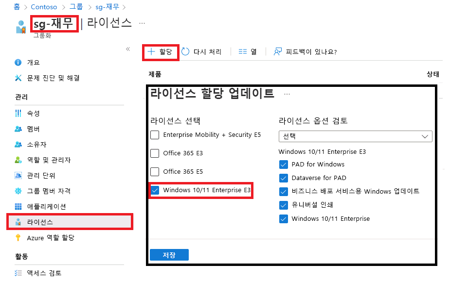

---
lab:
  title: 06 - 그룹 라이선스 할당 변경
  learning path: "01"
  module: Module 01 - Implement an identity management solution
ms.openlocfilehash: a76182eb79197a26a692c5bab7bfcde1080a97c2
ms.sourcegitcommit: a60b8d48791d600c44fa5fa617b6a9b2c0edaa71
ms.translationtype: HT
ms.contentlocale: ko-KR
ms.lasthandoff: 04/04/2022
ms.locfileid: "141368858"
---
# 랩 06: 그룹 라이선스 할당 변경

## 랩 시나리오

때로는 Azure AD 보안 그룹이 사용하는 라이선스 할당을 변경해야 할 수도 있습니다. 그룹의 라이선스 할당을 변경하는 절차를 숙지해야 합니다.

#### 예상 소요 시간: 5분

### 연습 1 - 그룹 라이선스 할당 변경

#### 작업 - Azure AD 포털을 사용하여 변경

1. [https://portal.azure.com/#blade/Microsoft_AAD_IAM/ActiveDirectoryMenuBlade/Overview]( https://portal.azure.com/#blade/Microsoft_AAD_IAM/ActiveDirectoryMenuBlade/Overview) 으로 이동합니다.

2. 왼쪽 탐색 영역의 **관리** 에서 **그룹** 을 선택합니다.

3. **sg-Finance** 그룹을 선택합니다.

4. 왼쪽 탐색 영역의 **관리** 에서 **라이선스** 를 선택합니다.

5. 현재 할당을 검토한 다음 메뉴에서 **+ 할당** 을 선택합니다.

    

6. 라이선스 할당 업데이트 블레이드에서 **Windows 10/11 Enterprise E3** 라이선스를 선택한 다음, 기존 라이선스 선택을 취소하고, 라이선스 옵션을 추가 또는 제거하거나 원하는 다른 작업을 수행합니다.

7. 완료되면 **저장** 을 선택합니다.

8. 그룹의 라이선스 페이지에서 변경 내용을 검토합니다.
