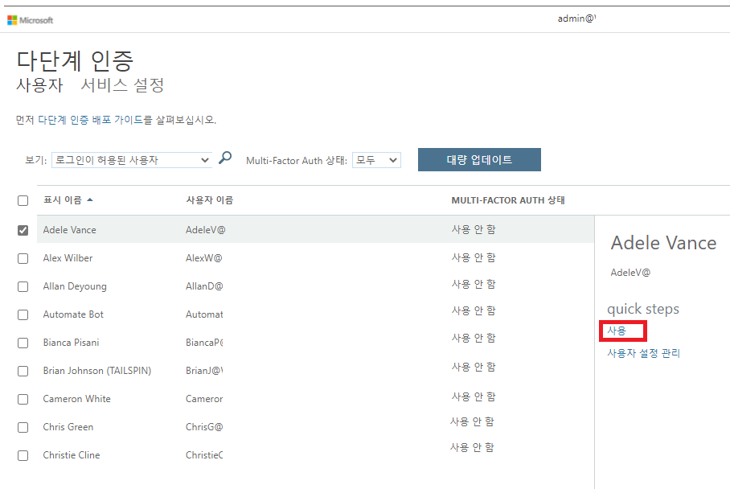

---
lab:
  title: 08 - 다단계 인증 사용
  learning path: '02'
  module: Module 02 - Implement an Authentication and Access Management Solution
---

# 랩 08 - 다단계 인증 사용

### 로그인 유형 = Microsoft 365 관리

## 랩 시나리오

조직의 보안을 강화하기 위해 Microsoft Entra ID에 대한 다단계 인증을 사용하도록 설정하라는 지시를 받았습니다.

#### 예상 소요 시간: 15분

**중요** - 이 연습에는 Microsoft Entra ID Premium 라이선스가 필요합니다.

### 연습 1 - Azure에서 다단계 인증 검토 및 사용

#### 작업 1 – Azure Multi-Factor Authentication 옵션 검토

1. [https://entra.microsoft.com](https://entra.microsoft.com)으로 이동한 후 해당 디렉터리에 대한 전역 관리자 계정을 사용하여 로그인합니다.

2. 검색 기능을 사용하여 **다단계**를 검색합니다.

3. 검색 결과에서 **다단계 인증**을 선택합니다.

    또는 **ID**를 열고 **보호**를 선택한 다음 **다단계 인증**을 선택할 수도 있습니다.

4. 시작 페이지의 **구성**에서 **추가 클라우드 기반 MFA 설정**을 선택합니다.

    

5. 새 브라우저 창에서 Azure 사용자 및 서비스 설정의 MFA 옵션을 볼 수 있습니다.

    

    여기서 지원되는 인증 방법을 선택합니다. 위 화면에서는 모든 방법이 선택되었습니다.

    사용자가 다단계 인증을 지원하지 않는 앱에 대해 고유한 계정 암호를 만들 수 있도록 여기서 앱 암호를 사용하거나 사용하지 않도록 설정할 수도 있습니다. 이 기능을 사용하면 사용자는 해당 앱과 관련된 다른 암호를 사용하여 Microsoft Entra ID로 인증할 수 있습니다.

#### 작업 2 - Delia Dennis를 위한 MFA 조건부 액세스 규칙 설정

다음으로, 네트워크의 특정 앱에 액세스하는 게스트 사용자에 대해 MFA를 적용하는 조건부 액세스 정책 규칙을 설정하는 방법을 살펴보겠습니다.

1. Microsoft Entra 관리 센터로 다시 전환하고 **ID**, **보호**, **조건부 액세스**를 차례로 선택합니다.

2. 메뉴에서 **+ 새 정책**을 선택합니다. 드롭다운에서 **+ 새 정책 만들기**를 선택합니다.

    

3. 정책 이름(예: **MFA_for_Delia**)을 지정합니다.

4. 할당에서 **사용자 또는 워크로드 ID**를 선택합니다.

    - **0명의 사용자 또는 워크로드 ID가 선택됨**을 선택합니다.  
    - 오른쪽 화면에서 **사용자 및 그룹 선택** 체크박스를 선택하여 구성합니다.
    - **사용자 및 그룹**을 선택합니다(사용 가능한 사용자가 오른쪽에 채워짐).
    - 사용자 목록에서 **Delia Dennis**를 선택한 후에 **선택** 단추를 선택합니다.

5. 대상 리소스에서 **선택된 대상 리소스 없음**을 선택합니다.

   - 드롭다운에서 **클라우드 앱**을 선택했는지 확인합니다.
   - 포함 아래에서 **모든 클라우드 앱**을 표시하고 스스로를 잠글 수 있다는 것에 대해 알리는 팝업 경고에 주의합니다. 
   - 이제 선택 섹션에서 **없음** 항목을 선택합니다.
   - 새로 열린 대화 상자에서 **Office 365**를 선택합니다.
      - **미리 알림** - 이전 랩에서 Delia Dennis는 Office 365 라이선스를 받고 로그인하여 정상적으로 작동하는 것을 확인했습니다.
   - **선택**을 선택합니다.

6. 조건 섹션을 검토합니다.

   - 구성 슬라이더에서 **예**를 선택합니다.
   - **모든 네트워크 또는 위치**를 선택합니다.

7. **Access Control**에서 **허용** 섹션을 찾아 **0개의 컨트롤이 선택됨**을 선택합니다.

8. MFA를 적용하려면 **다단계 인증 필요** 확인란을 선택합니다.

9. **모든 선택한 컨트롤 필요**가 선택되어 있는지 확인합니다.

10. **선택**을 선택합니다.

11. **정책 사용**을 **켜기**로 설정합니다.

12. **만들기**를 눌러 정책을 만듭니다.

    

    이제 선택한 사용자 및 애플리케이션에 대해 MFA가 사용하도록 설정되었습니다. 다음에 게스트가 해당 앱에 로그인하려고 하면 MFA에 등록하라는 메시지가 표시됩니다.

#### 작업 3 - Delia의 로그인 테스트

1. 새 InPrivate 탐색 창을 엽니다.
2. https://www.office.com에 연결합니다.
3. 로그인 옵션을 선택합니다.
4. **DeliaD@** `<<your domain address>>`를 입력합니다.
5. 암호 입력 = 테넌트의 전역 관리자 암호를 입력합니다(참고: 관리자 암호를 검색하려면 ‘랩 리소스’ 탭 참조).

**참고** - 이때 다음의 두 가지 중 하나가 발생합니다.  Authenticator 앱을 설정하고 MFA를 등록해야 한다는 메시지가 나타납니다.  개인 폰을 사용하여 프롬프트를 따라 완료합니다.  참고 - 진행 방법에 따라 여러 옵션에서 로그인 실패 메시지가 나타날 수 있습니다.  그럴 경우 **다시 시도** 옵션을 선택하세요.

로그인 실패 메시지가 표시되는 이유는 Delia에 대해 만든 조건부 액세스 규칙 때문입니다. Office 365 홈페이지를 시작하려면 MFA가 필요합니다.

### 연습 2 - 로그인에 필요하도록 MFA 구성

#### 작업 1 - Microsoft Entra 사용자별 MFA 구성

마지막으로, 사용자 계정에 대해 MFA를 구성하는 방법을 살펴봅시다. 다단계 인증 설정에 액세스하는 또 다른 방법입니다.

1. Microsoft Entra 관리 센터로 다시 전환하고 Indentity 왼쪽 탐색 메뉴를 찾습니다.

2. **사용자**를 선택한 다음 **모든 사용자**를 선택합니다.

3. 사용자 창의 맨 위에 있는 **사용자별 MFA**를 선택합니다.
  - 참고: 사용자별 MFA 메뉴 항목으로 이동하려면 줄임표(...)를 사용해야 할 수 있습니다.

   

4. 새로운 브라우저 탭/창이 다단계 인증 사용자 설정 대화 상자와 함께 열립니다.

   사용자를 선택하고 오른쪽에 있는 빠른 단계를 사용하여 사용자별로 MFA를 사용하거나 사용하지 않도록 설정할 수 있습니다.

   

5. 확인 표시로 **Adele Vance**를 선택합니다.
6. 빠른 단계 아래에서 **MFA 활성화** 옵션을 선택합니다.
7. 알림 팝업이 나타나면 읽어보고, **다단계 인증 사용** 단추를 선택합니다.
8. **닫기**를 선택합니다.
9. 이제 Adele는 MFA 상태가 **사용**으로 되어 있습니다.
10. 앞서 랩에서 본 MFA 설정 화면을 **서비스 설정**을 선택하여 볼 수 있습니다.
11. MFA 설정 탭을 닫습니다.

#### 작업 2 -- Adele로 로그인 시도

1. MFA 로그인 프로세스의 다른 예를 보려면 Adele로 로그인해 보면 됩니다.
