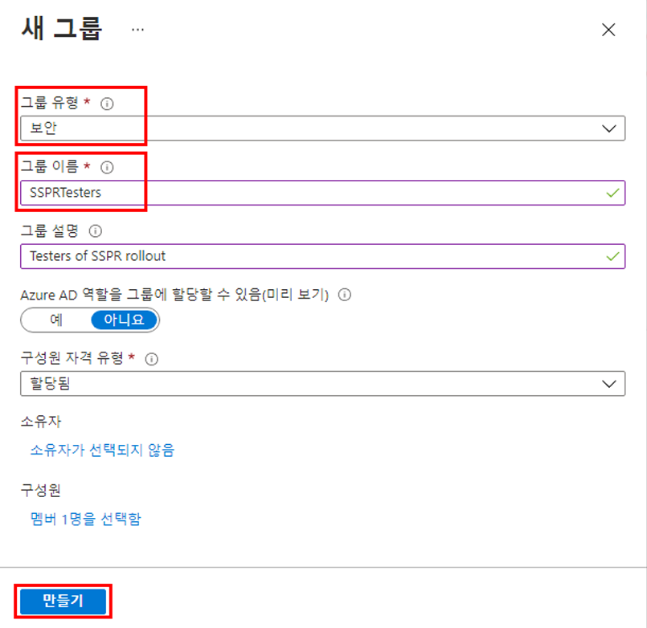
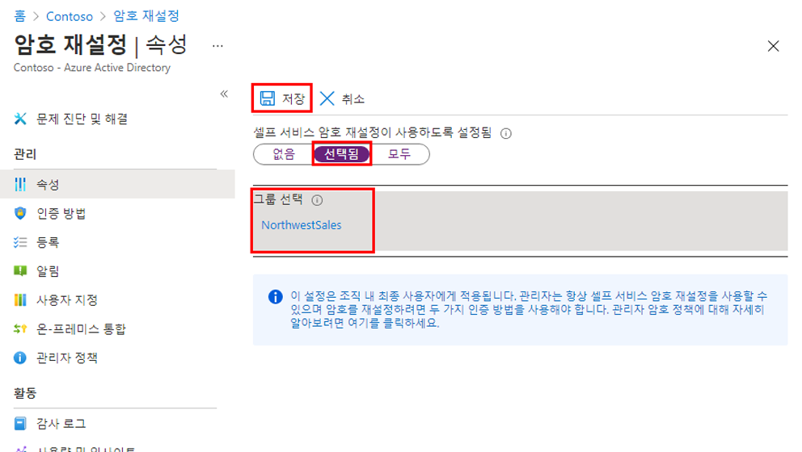

---
lab:
  title: 09 - Microsoft Entra 셀프 서비스 암호 재설정 사용
  learning path: '02'
  module: Module 02 - Implement an Authentication and Access Management Solution
---

# 랩 09 - 셀프 서비스 암호 재설정 구성 및 배포

### 로그인 유형 = Microsoft 365 관리

## 랩 시나리오

회사는 셀프 서비스 암호 재설정을 직원들이 사용할 수 있도록 하기로 결정했습니다. 조직에서 이 설정을 구성해야 합니다.

#### 예상 소요 시간: 15분

### 연습 1 - SSPR을 사용하도록 설정한 그룹을 만들어 사용자 추가

#### 작업 1 - SSPR을 할당할 그룹 만들기

SSPR 구성이 예상대로 작동하는지 확인하기 위해 SSPR을 제한된 사용자에게 먼저 배포하려고 합니다. 제한된 롤아웃용 보안 그룹을 만들고 그룹에 사용자를 추가해 보겠습니다.

1. Microsoft Entra 관리 센터에서 왼쪽의 **ID** 탐색 메뉴를 엽니다.
1. **그룹**아래에서 **모든 그룹**을 선택하고 오른쪽 창에 있는 **새 그룹**을 선택합니다.

2. 다음 정보를 사용하여 새 그룹을 생성합니다.

    | **설정**| **값**|
    | :--- | :--- |
    | 그룹 형식| 보안|
    | 그룹 이름| SSPRTesters|
    | 그룹 설명| SSPR 출시 테스터|
    | 멤버 자격 유형| 할당됨|
    | 멤버| Alex Wilber |
    | |  Allan Deyoung |
    | | Bianca Pisani |
  
    
3.  **만들기**를 선택합니다.

    

#### 작업 2 - 테스트 그룹을 대상으로 SSPR을 사용하도록 설정

그룹에 SSPR을 사용하도록 설정합니다.

1. **ID** 탐색 메뉴로 돌아갑니다.

2.  **보호**아래에서  **암호 재설정**을 선택합니다.

3. 암호 재설정 페이지 속성 페이지의 **셀프 서비스 암호 재설정 사용**에서 **선택됨**을 선택합니다.

4. **그룹 선택**에서 기존 SSPRSecurityGroupUsers를 방금 만든 **SSPRTesters**로 바꿉니다.

5. 암호 재설정 페이지의 속성 페이지에서 **저장**을 선택합니다.

    

6. **암호 재설정** 화면에서  **관리* 아래에 보이는  **인증 방법 **,  **등록**, **알림** 및 **사용자 지정**의 각 설정에 대한 기본값을 선택하고 검토합니다.

    **참고** 이 랩의 나머지 부분에서는 인증 방법 중 하나로 **휴대폰**을 선택해야 하지만 다른 옵션도 사용할 수 있습니다.

#### 작업 3 - Allan과 함께 SSPR 등록

이제 SSPR 구성이 완료되었으므로 직접 만든 사용자의 휴대폰 번호를 등록합니다.

1. 다른 브라우저를 열거나 InPrivate 또는 Incognito 브라우저 세션을 연 다음, [https://aka.ms/ssprsetup](https://aka.ms/ssprsetup)으로 이동합니다.

    이렇게 하면 사용자 인증에 관한 메시지가 표시됩니다.

2. 제공된 비밀번호를 사용하여 **AllanD@**`<<organization-domain-name>>.onmicrosoft.com`로 로그인합니다.

    **참고** - 조직 도메인 이름을 도메인 이름으로 바꿉니다.

3. 암호를 업데이트하라는 메시지가 표시되면 선택한 새 암호를 입력합니다. 새 암호를 기록해야 합니다.

4. 로그인 상태를 유지할지 묻는 메시지가 표시되면 예를 선택합니다.

5. **추가 정보 필요** 대화 상자에서 **다음**을 선택합니다.

6. 계정 보안 유지 페이지에서 **다음**을 선택하여 Authenticator 앱을 사용합니다.

7. 화면의 지침에 따라 QR 코드를 스캔하여 Authenticator에서 계정을 설정합니다.

8. 등록에 성공하면 **완료**를 선택하여 프로세스를 완료합니다.

  - **참고** - 이 시점에서 단일 단계에서 SSPR 및 MFA에 모두 등록했습니다.

11. 브라우저를 닫습니다. 로그인 프로세스를 완료할 필요가 없습니다.

#### 작업 4 - SSPR 테스트

이제 사용자가 암호를 다시 설정할 수 있는지 테스트하겠습니다.

1. 다른 브라우저를 열거나 InPrivate 또는 Incognito 브라우저 세션을 연 다음, [https://portal.azure.com](https://portal.azure.com)으로 이동합니다.

    이렇게 하면 사용자 인증에 관한 메시지가 잘 표시됩니다.

2. **AlexW@** `<<organization-domain-name>>.onmicrosoft.com`을 입력하고 **다음**을 선택합니다.

    **참고** - 조직 도메인 이름을 도메인 이름으로 바꿉니다.

3. 암호 입력 페이지에서 **암호를 잊어버렸습니다.** 를 선택합니다.

4. 사용자 계정으로 돌아가기 페이지에서 요청된 정보를 완료한 후 **다음**을 선택합니다.

5. 화면상의 지침에 따라 Microsoft Authenticator 앱에서 확인 코드를 받습니다.

6. 확인 코드를 입력하고 **다음**을 선택합니다.

7. 새 암호 선택 단계에서 새 암호를 입력하고 확인합니다.

8. 구성이 완료되면 **마침**을 선택합니다.

9. 새로 만든 비밀번호를 사용하여 **AllanD**로 로그인합니다.

10. 확인 코드를 입력한 후 로그인 프로세스를 완료할 수 있는지 확인합니다.

11. 완료되면 브라우저를 닫습니다.

#### 작업 5 - SSPRTesters 그룹에 없는 사용자로 로그인을 시도할 때의 결과 확인

1. 테스트를 위해 새 InPrivate 브라우저 창을 열고 GradyA로 Azure Portal에 로그인해 봅니다. 로그인 화면에서 **암호를 잊어버렸음** 옵션을 선택합니다.
