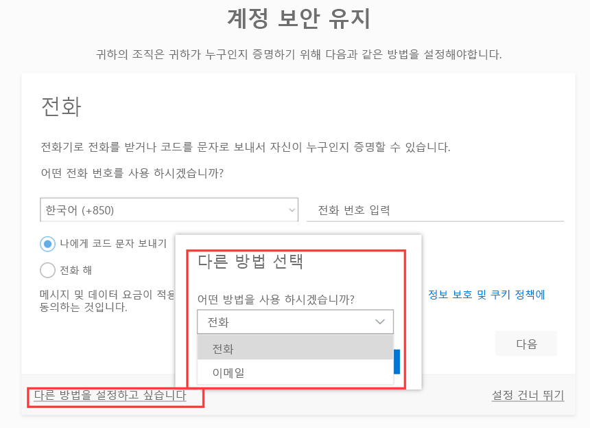

---
lab:
  title: 13 - Azure AD 셀프 서비스 암호 재설정 사용
  learning path: "02"
  module: Module 02 - Implement an Authentication and Access Management Solution
ms.openlocfilehash: a812d4a197cee989dcea0a2693df2e66d1bd2dfa
ms.sourcegitcommit: 448f935ad266989a6f0086019e0c0e0785ad162b
ms.translationtype: HT
ms.contentlocale: ko-KR
ms.lasthandoff: 02/10/2022
ms.locfileid: "138421434"
---
# 랩 13 - 셀프 서비스 암호 재설정 구성 및 배포
## 랩 시나리오

회사는 셀프 서비스 암호 재설정을 직원들이 사용할 수 있도록 하기로 결정했습니다. 조직에서 이 설정을 구성해야 합니다.

#### 예상 소요 시간: 15분

### 연습 1 - SSPR을 사용하도록 설정한 그룹을 만들어 사용자 추가

#### 작업 1 - SSPR을 할당할 그룹 만들기

SSPR 구성이 예상대로 작동하는지 확인하기 위해 SSPR을 제한된 사용자에게 먼저 배포하려고 합니다. 제한된 롤아웃용 보안 그룹을 만들고 그룹에 사용자를 추가해 보겠습니다.

1. Azure Active Directory 블레이드의 **관리** 에서 **그룹** 을 선택하고 오른쪽 창에서 **+ 새 그룹** 을 선택합니다.

2. 다음 정보를 사용하여 새 그룹을 생성합니다.

    | **설정**| **값**|
    | :--- | :--- |
    | 그룹 형식| 보안|
    | 그룹 이름| SSPRTesters|
    | 그룹 설명| SSPR 출시 테스터|
    | 멤버 자격 유형| 할당됨|
    | 멤버| Alex Wilber |
    | |  Allan Deyoung |
    | | Bianca Pisani |
  
    
3. **만들기** 를 선택합니다.

    

#### 작업 2 - 테스트 그룹을 대상으로 SSPR을 사용하도록 설정

그룹에 SSPR을 사용하도록 설정합니다.

1. Azure Active Directory 블레이드로 돌아갑니다.

2. **관리** 에서 **암호 재설정** 을 선택합니다.

3. 암호 재설정 블레이드 속성 페이지의 **셀프 서비스 암호 재설정 사용** 에서 **선택됨** 을 선택합니다.

4. **그룹 선택** 을 선택합니다.

5. 기본 암호 재설정 정책 창에서 **SSPRTesters** 그룹을 선택합니다.

6. 암호 재설정 블레이드 속성 페이지에서 **저장** 을 선택합니다.

    

7. **관리** 에서 **인증 방법**, **등록**, **알림** 및 **사용자 지정** 설정의 기본값을 선택하고 검토합니다.

    **참고** 이 랩의 나머지 부분에서는 인증 방법 중 하나로 **휴대폰** 을 선택해야 하지만 다른 옵션도 사용할 수 있습니다.

#### 작업 3 - Alex가 SSPR을 사용하도록 등록

이제 SSPR 구성이 완료되었으므로 직접 만든 사용자의 휴대폰 번호를 등록합니다.

1. 다른 브라우저를 열거나 InPrivate 또는 Incognito 브라우저 세션을 연 다음, [https://aka.ms/ssprsetup](https://aka.ms/ssprsetup)으로 이동합니다.

    이렇게 하면 사용자 인증에 관한 메시지가 잘 표시됩니다.

2. 암호를 사용하여 **AlexW@** `<<organization-domain-name>>.onmicrosoft.com`으로 로그인 = 테넌트의 관리자 암호를 입력합니다(관리자 암호를 검색하려면 랩 리소스 탭 참조).

    **참고** - 조직 도메인 이름을 도메인 이름으로 바꿉니다.

3. 암호를 업데이트하라는 메시지가 표시되면 선택한 새 암호를 입력합니다. 새 암호를 기록해야 합니다.

4. **추가 정보 필요** 대화 상자에서 **다음** 을 선택합니다.

5. 계정 보안 유지 페이지에서 **휴대폰** 옵션을 사용하도록 선택합니다.

    

    **참고** - 이 랩에서는 **휴대폰** 옵션을 사용합니다. 휴대폰 세부 정보를 입력합니다.

6. 전화 번호 필드에 개인 휴대폰 번호를 입력합니다.
7. **코드를 문자로 받기** 를 선택합니다.
8. **다음** 을 선택합니다.

9. 휴대폰에서 코드를 받으면 텍스트 상자에 코드를 입력한 후 **다음** 을 선택합니다.

10. 휴대폰을 등록한 후 **다음** 을 선택하고 **완료** 를 선택합니다.

11. 브라우저를 닫습니다. 로그인 프로세스를 완료할 필요가 없습니다.

#### 작업 4 - SSPR 테스트

이제 사용자가 암호를 다시 설정할 수 있는지 테스트하겠습니다.

1. 다른 브라우저를 열거나 InPrivate 또는 Incognito 브라우저 세션을 연 다음, [https://portal.azure.com](https://portal.azure.com)으로 이동합니다.

    이렇게 하면 사용자 인증에 관한 메시지가 잘 표시됩니다.

2. **AlexW@** `<<organization-domain-name>>.onmicrosoft.com`을 입력하고 **다음** 을 선택합니다.

    **참고** - 조직 도메인 이름을 도메인 이름으로 바꿉니다.

3. 암호 입력 페이지에서 **암호를 잊어버렸습니다.** 를 선택합니다.

4. 사용자 계정으로 돌아가기 페이지에서 요청된 정보를 완료한 후 **다음** 을 선택합니다.

    

5. **확인 단계 1** 작업에서 **내 휴대폰으로 문자 보내기** 를 선택하고 전화 번호를 입력한 다음 **문자** 를 선택합니다.

    

6. 확인 코드를 입력하고 **다음** 을 선택합니다.

7. 새 암호 선택 단계에서 새 암호를 입력하고 확인합니다.  권장 암호 = **Pass@w.rd1234** .

8. 구성이 완료되면 **마침** 을 선택합니다.

9. 방금 만든 새 암호를 사용하여 **AlexW** 로 로그인합니다.

10. 확인 코드를 입력한 후 로그인 프로세스를 완료할 수 있는지 확인합니다.

11. 완료되면 브라우저를 닫습니다.

#### 작업 5 - SSPRTesters 그룹에 없는 사용자로 로그인을 시도할 때의 결과 확인

1. 테스트를 위해 새 InPrivate 브라우저 창을 열고 GradyA로 Azure Portal에 로그인해 봅니다. 로그인 화면에서 **암호를 잊어버렸음** 옵션을 선택합니다.
