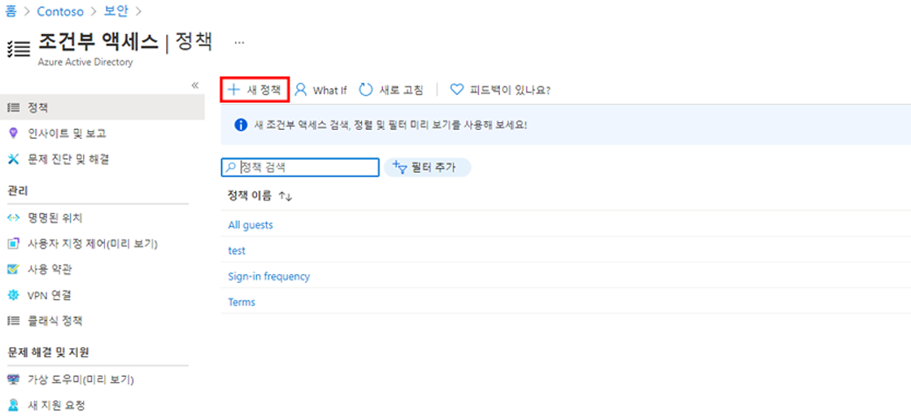
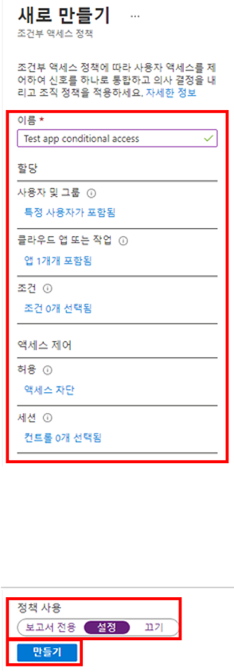
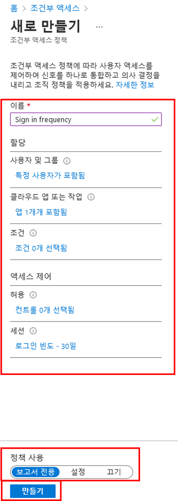

---
lab:
  title: 13 - 조건부 액세스 정책 구현 및 테스트
  learning path: "02"
  module: Module 02 - Implement an Authentication and Access Management Solution
ms.openlocfilehash: 495af1fb6b24a421754f186f445aca78a6f9f15c
ms.sourcegitcommit: 80c5c0ef60c1d74fcc58c034fe6be67623013cc0
ms.translationtype: HT
ms.contentlocale: ko-KR
ms.lasthandoff: 07/01/2022
ms.locfileid: "146823201"
---
# 랩 13 - 조건부 액세스 정책 구현 및 테스트

## 랩 시나리오

조직에서 내부 애플리케이션에 대한 사용자 액세스를 제한할 수 있어야 합니다. Azure Active Directory 조건부 액세스 정책을 배포해야 합니다.

**참고** - 조건부 액세스 정책의 경우 보안 기본값을 해제할 수 있습니다. 기억해야 할 핵심 사항은 학습에서 확인할 수 있습니다.  보안 기본값에 대한 추가 정보는 <https://docs.microsoft.com/en-us/azure/active-directory/fundamentals/concept-fundamentals-security-defaults> 링크에서 찾을 수 있습니다.

#### 예상 소요 시간: 30분

### 연습 1 - DebraB의 Yammer 액세스를 차단하는 조건부 액세스 정책 설정

#### 작업 1 - DebraB에게 Yammer 액세스 권한이 있는지 확인

1. 새 InPrivate 브라우저 창을 시작합니다.
2. [https://www.office.com](https://www.office.com)에 연결 
3. 메시지가 표시되면 DebraB로 로그인합니다.

   | 설정 | 값 |
   | :--- | :--- |
   | 사용자 이름 | **DebraB@** `<<your lab domain>>.onmicrosoft.com` |
   | 암호 | 테넌트의 관리자 암호를 입력합니다(테넌트 관리자 암호를 검색하려면 랩 리소스 탭 참조). |
    
4. Yammer 아이콘을 선택하여 Yammer가 정상적으로 로드되는지 확인합니다.

#### 작업 2 - 조건부 액세스 정책 만들기

Azure Active Directory 조건부 액세스는 리소스에 액세스 할 수 있는 사용자를 제어하는 상세 정책을 지정할 수 있는 Azure AD의 고급 기능입니다. 조건부 액세스를 사용하여 그룹, 디바이스 유형, 위치 및 역할과 같은 항목에 따라 사용자의 액세스를 제한하여 애플리케이션을 보호할 수 있습니다.

1. [https://portal.azure.com](https://portal.azure.com)으로 이동한 후 해당 디렉터리에 대한 전역 관리자 계정을 사용하여 로그인합니다.

2. 포털 메뉴를 열고 **Azure Active Directory** 를 선택합니다.

3. Azure Active Directory 페이지의 **관리** 에서 **보안** 을 선택합니다.

4. 보안 페이지의 왼쪽 탐색 영역에서 **조건부 액세스** 를 선택합니다.

5. 상단 메뉴의 드롭다운에서 **+ 새 정책** 을 선택하고 **새 정책 만들기** 를 선택합니다.

   

6. **이름** 상자에 **DebraB에 대해 Yammer 차단** 을 입력합니다.

   **참고** - 이러한 명명 규칙을 사용하면 정책과 해당 기능을 빠르게 파악할 수 있습니다.

7. **할당** 아래에서 **사용자 또는 워크로드 ID** 를 선택합니다.

8. 포함 탭에서 **사용자 및 그룹** 확인란을 선택합니다.

9. 선택 창에서 **DebraB** 계정을 선택한 다음 **선택** 을 선택합니다.

10. **클라우드 앱 또는 작업** 을 선택합니다.

11. **클라우드 앱** 이 선택되어 있는지 확인하고 **앱 선택** 을 선택합니다.

12. 선택 창에서 **Yammer** 를 검색한 후 **Office 365 Yammer** 를 선택하고 **선택** 을 선택합니다.

13. **액세스 제어** 에서 **권한 부여** 를 선택합니다.

14. 허용 창에서 **액세스 차단** 을 선택하고 **선택** 을 선택합니다.

   **참고** - 이 정책은 연습에 대해서만 구성되며 조건부 액세스 정책을 신속하게 설명하는 데 사용됩니다.

15. **정책 사용** 에서 **On** 을 선택한 다음, **만들기** 를 선택합니다.

   

#### 작업 3 - 조건부 액세스 정책 테스트

조건부 액세스 정책을 테스트하여 예상대로 작동하는지 확인해야 합니다.

1. 새 ‘Inprivate’ 브라우저 탭을 열고 [https://www.yammer.com/office365](https://www.yammer.com/office365)로 이동합니다.
    - 메시지가 표시되면 DebraB로 로그인합니다.

   | 설정 | 값 |
   | :--- | :--- |
   | 사용자 이름 | **DebraB@** `<<your lab domain>>.onmicrosoft.com` |
   | 암호 | 테넌트의 관리자 암호를 입력합니다(테넌트 관리자 암호를 검색하려면 랩 리소스 탭 참조). |
     
2. Microsoft Yammer에 액세스할 수 없도록 되어 있는지 확인합니다.

   

3. 로그인되어 있으면 탭을 닫고 1분 동안 기다렸다가 다시 시도합니다.
    
   **참고** - Yammer에 DebraB로 자동 로그인되면 수동으로 로그아웃해야 합니다.  Yammer에 자동으로 로그인되는 이유는 자격 증명/액세스가 캐시되었기 때문입니다.  로그아웃했다가 다시 로그인하면 Yammer 세션에서 액세스가 거부됩니다.

4. 탭을 닫고 조건부 액세스 페이지로 돌아갑니다.

5. **Yammer 조건부 액세스** 정책을 선택합니다.

6. **정책 사용** 에서 **끄기** 를 선택한 다음, **저장** 을 선택합니다.

### 연습 2 - “What if”를 사용하여 조건부 액세스 정책 테스트

#### 작업 - What if를 사용하여 조건부 액세스 정책 테스트

1. 포털 메뉴를 열고 **Azure Active Directory** 를 선택합니다.

1. Azure Active Directory 페이지의 **관리** 에서 **보안** 을 선택합니다.

1. 보안 페이지의 왼쪽 탐색 영역에서 **조건부 액세스** 를 선택합니다.

1. **What if** 를 선택합니다.

1. **사용자 또는 워크로드 ID** 에서 **사용자 또는 서비스 주체가 선택되지 않음** 을 선택합니다.

1. 사용자로 **DebraB** 를 선택합니다.

1. **클라우드 앱, 작업 또는 인증 컨텍스트** 에서 **Yammer** 를 선택합니다. 

1. **What if** 를 선택합니다. **적용할 정책** 및 **적용하지 않을 정책** 에 대한 타일 아래쪽에 보고서가 제공됩니다.

이렇게 하면 정책을 사용하도록 설정하기 전에 정책 및 정책의 영향을 테스트할 수 있습니다.

### 연습 3 - 조건부 액세스 정책을 사용하여 로그인 빈도 제어 구성

#### 작업 - 조건부 액세스를 구성하는 Azure Portal 사용자

회사 보안 구성의 일환으로, 로그인 빈도를 제어하는 데 사용할 수 있는 조건부 액세스 정책을 테스트해야 합니다.

1. [https://portal.azure.com](https://portal.azure.com)으로 이동한 후 해당 디렉터리에 대한 전역 관리자 계정을 사용하여 로그인합니다.

2. 포털 메뉴를 열고 **Azure Active Directory** 를 선택합니다.

3. Azure Active Directory 페이지의 **관리** 에서 **보안** 을 선택합니다.

4. 보안 페이지의 왼쪽 탐색 영역에서 **조건부 액세스** 를 선택합니다.

5. 상단 메뉴의 드롭다운에서 **+ 새 정책** 을 선택하고 **새 정책 만들기** 를 선택합니다.

   

6. **이름** 상자에 **로그인 빈도** 를 입력합니다.

7. **할당** 아래에서 **사용자 또는 워크로드 ID** 를 선택합니다.

8. 포함 탭에서 **사용자 및 그룹** 확인란을 선택합니다.

9. 선택 창에서 **Grady Archie** 계정을 선택한 다음 **선택** 을 선택합니다.

10. **클라우드 앱 또는 작업** 을 선택합니다.

11. **클라우드 앱** 이 선택되어 있는지 확인하고 **앱 선택** 을 선택합니다.

12. 선택 창에서 **Office 365** 를 선택하고 **선택** 을 선택합니다.

13. **액세스 제어** 에서 **세션** 을 선택합니다.

14. 세션 창에서 **로그인 빈도** 를 선택합니다.

15. 값 상자에 **30** 을 입력합니다.

16. 단위 메뉴를 선택하고 **일** 을 선택한 다음 **선택** 을 선택합니다.

17. **정책 사용** 에서 **보고 전용** 을 선택한 다음, **생성** 를 선택합니다.

   

   **참고** - 보고 전용 모드는 관리자가 정책을 환경에 사용하도록 설정하기 전에 조건부 액세스 정책의 영향을 평가할 수 있도록 하는 새 조건부 액세스 정책 상태입니다. 보고 전용 모드의 릴리스 사용
    
- 조건부 액세스 정책은 보고 전용 모드에서 사용하도록 설정할 수 있습니다.
- 로그인하는 동안 보고 전용 모드의 정책은 평가되지만 적용되지 않습니다.
- 결과는 로그인 로그 세부 정보에 대한 조건부 액세스 및 보고 전용 탭에 기록됩니다.
- Azure Monitor 구독이 있는 고객은 조건부 액세스 인사이트 통합 문서를 사용하여 조건부 액세스 정책의 영향을 모니터링할 수 있습니다.
