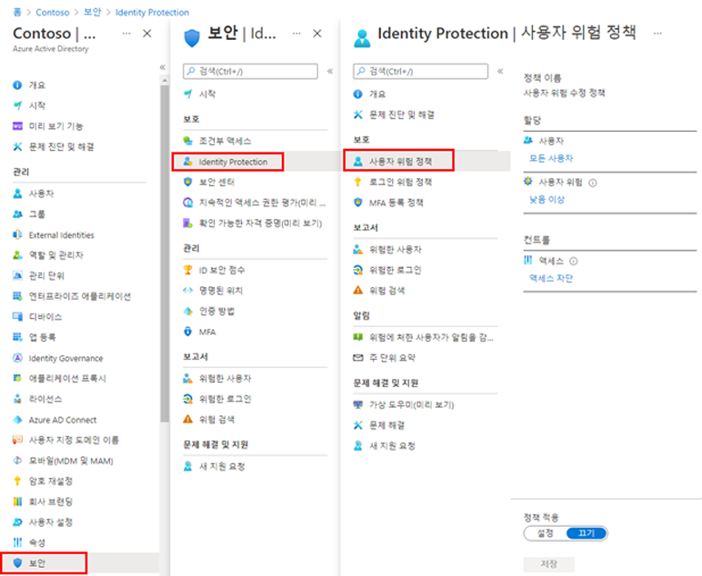

---
lab:
  title: 14 - 로그인 및 사용자 위험 정책 사용
  learning path: '02'
  module: Module 02 - Implement an Authentication and Access Management Solution
---

# 랩 14 - 로그인 및 사용자 위험 정책 사용

## 랩 시나리오

추가 보안 계층으로 Microsoft Entra 조직의 로그인 및 사용자 위험 정책을 사용하도록 설정하고 구성해야 합니다.

#### 예상 소요 시간: 10분

### 연습 1 - 사용자 위험 정책 사용

#### 작업 1 - 정책 구성

1. 전역 관리자 계정을 사용하여 [https://entra.microsoft.com]( https://entra.microsoft.com)에 로그인합니다.

2. 포털 메뉴를 열고  **Microsoft Entra ID**를 선택합니다.

3. 메뉴의 **ID**에서 **보호**를 선택합니다.

4. 보안 페이지의 왼쪽 탐색 영역에서 **ID 보호**를 선택합니다.

5. ID 보호 페이지의 왼쪽 탐색 영역에서 **사용자 위험 정책**을 선택합니다.

    

6. **할당**에서 **모든 사용자**를 선택하고 사용 가능한 옵션을 검토합니다.

7. 롤아웃을 제한하는 경우 **모든 사용자** 또는 **개인 및 그룹 선택**에서 선택할 수 있습니다.

8. 또한 정책에서 사용자를 제외하도록 선택할 수 있습니다.

9. **사용자 위험**에서 **낮음 이상**을 선택합니다.

10. 사용자 위험 창에서 **높음**을 선택한 다음, **완료**를 선택합니다.

11. **컨트롤** > **액세스**에서 **액세스 차단**을 선택합니다.

12. 액세스 창에서 사용 가능한 옵션을 검토합니다.

    **팁** - 액세스를 허용하고 암호 변경을 요구하는 것이 좋습니다.

13. **암호 변경 필요** 확인란을 선택한 다음, **완료**를 선택합니다.

14. **정책 적용**에서 **사용**을 선택한 다음, **저장**을 선택합니다.

#### 작업 2 - 로그인 위험 정책 사용

1. ID 보호 페이지의 왼쪽 탐색 영역에서 **로그인 위험 정책**을 선택합니다.

2. 사용자 위험 정책과 마찬가지로, 로그인 위험 정책을 사용자 및 그룹에 할당할 수 있으며 이를 사용하여 정책에서 사용자를 제외할 수 있습니다.

3. **로그인 위험**에서 **낮음 이상**을 선택합니다.

4. 로그인 위험 창에서 **높음**을 선택한 다음, **완료**를 선택합니다.

5. **컨트롤** > **액세스**에서 **액세스 차단**을 선택합니다.

6. **다단계 인증 필요** 확인란을 선택한 다음 **완료**를 선택합니다.

7. **정책 적용**에서 **사용**을 선택한 다음, **저장**을 선택합니다.
