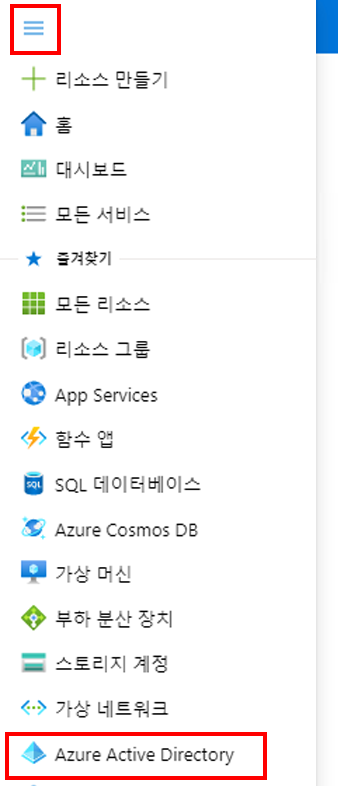
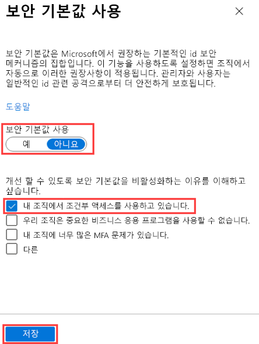

---
lab:
  title: 14 - Azure AD 다단계 인증 사용
  learning path: "02"
  module: Module 02 - Implement an Authentication and Access Management Solution
ms.openlocfilehash: 1561aad5cf589b73ffbb3592fb20e2910ddff9c6
ms.sourcegitcommit: 448f935ad266989a6f0086019e0c0e0785ad162b
ms.translationtype: HT
ms.contentlocale: ko-KR
ms.lasthandoff: 02/10/2022
ms.locfileid: "138421365"
---
# 랩 14 - 보안 기본값 사용

## 랩 시나리오

조직에서 Azure Active Directory 기본 보안 설정을 구성해야 합니다.
    **이 랩은 필요한 경우에만 진행하면 됩니다!**  보안 기본값을 설정/해제하여 메뉴 옵션의 위치를 확인할 수도 있습니다.  그러나 이 랩에서 수행하는 작업과 관련된 요점은 교육 내용에 모두 포함되어 있습니다.  보안 기본값을 설정한 상태로 두면 이어지는 조건부 액세스 관련 랩의 작업이 정상적으로 진행되지 않습니다.

#### 예상 소요 시간: 7분

### 연습 - 사전 작업

보안 기본값을 사용하도록 설정하려면 기존 조건부 액세스 정책을 삭제하거나 사용하지 않도록 설정해야 합니다.  이전 랩에서 Delia에 대해 MFA를 적용하는 정책을 빌드했음을 상기시켜 줍니다.  아래 단계를 수행하려면 이를 사용하지 않도록 설정해야 합니다.

1. Azure Portal에 로그인합니다.
2. Azure Active Directory를 엽니다.
3. 메뉴의 보안 섹션에서 **보안** 을 선택한 다음, **조건부 액세스** 를 선택합니다.
4. 켜기 또는 보고 전용으로 설정된 조건부 액세스 정책을 클릭하고 끄기로 변경합니다.

### 연습 1 - 보안 기본값 사용

#### 작업 1 - 보안 기본값 켜기

디렉터리에서 보안 기본값을 사용하도록 설정하려면

1. [https://portal.azure.com](https://portal.azure.com)으로 이동한 후 해당 디렉터리에 대한 전역 관리자 계정을 사용하여 로그인합니다.

2. **포털 표시 메뉴** 햄버거 아이콘을 선택하고 **Azure Active Directory** 를 선택합니다.

    

3. 왼쪽 창의 관리 섹션에서 **속성** 을 선택합니다.

4. 속성 블레이드의 아래쪽에서 **보안 기본값 관리** 를 선택합니다.

5. **보안 기본값 사용** 토글을 **예** 로 설정합니다.

6. 이는 이미 사용하도록 설정되어 있을 수 있습니다.

7. **저장** 을 선택합니다.

#### 작업 2 - 보안 기본값 사용 안 함

보안 기본값을 대체하는 조건부 액세스 정책을 구현하도록 선택하는 조직은 보안 기본값을 사용하지 않도록 설정해야 합니다.

디렉터리에서 보안 기본값을 사용하지 않도록 설정하려면

1. [https://portal.azure.com](https://portal.azure.com/)으로 이동한 후 해당 디렉터리에 대한 전역 관리자 계정을 사용하여 로그인합니다.

2. **포털 표시 메뉴** 햄버거 아이콘을 선택하고 **Azure Active Directory** 를 선택합니다.

3. 속성 블레이드의 아래쪽에서 **보안 기본값 관리** 를 선택합니다.

4. **보안 기본값 사용** 토글을 **아니요** 로 설정합니다.

    

5. **저장** 을 선택합니다.
