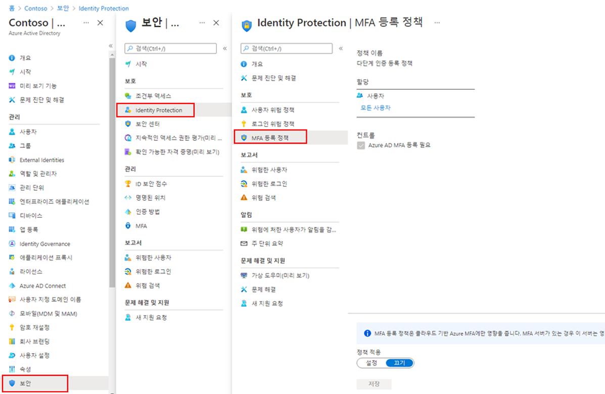

---
lab:
  title: 15 - 다단계 인증 등록 정책 구성
  learning path: '02'
  module: Module 02 - Implement an Authentication and Access Management Solution
---

# 랩 15 - 다단계 인증 등록 정책 구성

## 랩 시나리오

다단계 인증은 사용자 이름과 암호 이외에 추가 기능을 사용하는 사용자를 확인하는 수단을 제공합니다. 사용자 로그인에 대한 두 번째 보안 계층을 제공합니다. 사용자가 MFA 프롬프트에 응답하려면 먼저 Microsoft Entra 다단계 인증에 등록해야 합니다. 모든 사용자에게 할당되도록 Microsoft Entra 조직의 MFA 등록 정책을 구성해야 합니다.

#### 예상 소요 시간: 10분

### 연습 1 - MFA 등록 정책 설정

#### 작업 1 - 정책 구성

1. 전역 관리자 계정을 사용하여 [https://entra.microsoft.com]( https://entra.microsoft.com)에 로그인합니다.

2. 포털 메뉴를 열고 Microsoft Entra ID **를 선택합니다**.

3. 왼쪽 맨의 ID** 아래에서 **보호를** 선택합니다**.

4. 보안 페이지의 왼쪽 탐색 영역에서 **ID 보호**를 선택합니다.

5. ID 보호 페이지의 왼쪽 탐색 영역에서 **보호** 아래에서 **다단계 인증 등록 정책**을 선택합니다.

    

6. **할당**에서

7. **할당**에서 **모든 사용자**를 선택하고 사용 가능한 옵션을 검토합니다.

8. 롤아웃을 제한하는 경우 **모든 사용자** 또는 **개인 및 그룹 선택**에서 선택할 수 있습니다.

9. 또한 정책에서 사용자를 제외하도록 선택할 수 있습니다.

10. **컨트롤**에서 **Microsoft Entra ID 다단계 인증 등록 필요**가 선택되어 있고 변경할 수 없음을 알 수 있습니다.

#### 작업 2 - MFA 등록을 위한 Microsoft Entra Identity Protection 정책 구성

**참고**: Microsoft Entra Identity Protection을 사용하려면 Microsoft Entra ID Premium P2를 활성화해야 합니다. 

1. Microsoft Entra 관리 센터의 검색 창에서 Microsoft Entra Identity Protection**으로 이동합니다**.

1. 메뉴의 보호**에서 **다단계 인증 등록 정책을** 선택합니다**.

1. **할당**에서 사용자 아래의 **모든 사용자**를 선택하고 MFA를 적용할 사용자를 선택합니다.

1. **정책 적용**을 **끄기**에서 **켜기**로 변경합니다.

1. **저장**을 선택합니다.

이렇게 하려면 사용자가 다음에 로그인을 시도할 때 MFA 등록을 완료해야 합니다.

1. 프라이빗 브라우저에서 `https://login.microsoftonline.com`으로 이동합니다. 테넌트에서 사용자 이름 및 암호를 입력합니다.  사용자에게 입력하라는 추가 보안 정보 요구 사항을 확인합니다.
