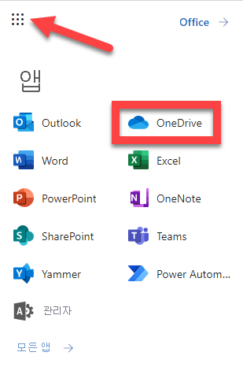

---
lab:
  title: 18 - 클라우드용 Defender Apps 액세스 정책
  learning path: "03"
  module: Module 03 - Implement Access Management for Apps
ms.openlocfilehash: 96c7c24c45e155c80a6e8c44852fb930c36aa876
ms.sourcegitcommit: 80c5c0ef60c1d74fcc58c034fe6be67623013cc0
ms.translationtype: HT
ms.contentlocale: ko-KR
ms.lasthandoff: 07/01/2022
ms.locfileid: "146823210"
---
# 18 - 클라우드용 Defender Apps 액세스 및 세션 정책

## 랩 시나리오

클라우드용 Microsoft Defender Apps를 사용하여 모니터링하는 클라우드 앱과 관련된 추가 조건부 액세스 정책을 만들 수 있습니다.  이러한 정책 만들기는 클라우드용 Microsoft Defender Apps 포털 내의 제어 메뉴 내에서 수행할 수 있습니다.

#### 예상 소요 시간: 20분

### 연습 1 - 클라우드용 Defender Apps 액세스 정책 만들기

#### 작업 1 - 클라우드용 Defender Apps에서 작동하도록 Azure AD 구성

1. [portal.azure.com](portal.azure.com)으로 이동하고 Azure Active Directory로 이동합니다.

1. **관리** 에서 **보안** 을 선택 합니다.

1. **보호** 에서 **조건부 액세스** 를 선택합니다.

1. **+ 새 정책** 드롭다운을 선택하고 **새 정책 만들기** 를 선택합니다.

1. **클라우드용 Defender Apps 제어** 와 같은 정책 이름을 입력합니다.

1. **사용자 또는 워크로드 ID** 에서 **선택한 사용자 또는 워크로드 ID** 를 선택하고 **사용자 및 그룹 선택** 및 **사용자 및 그룹** 을 선택합니다.

1. 랩 테넌트에 대한 관리 사용자 계정을 선택하고 **선택** 을 선택합니다.

1. **클라우드 앱 또는 작업** 에서 **선택한 클라우드 앱, 작업 또는 인증 컨텍스트가 없습니다** 를 선택합니다.

1. **앱 선택**, **Microsoft Cloud App Security**, **Office 365 Exchange Online**, **Office 365** 를 선택하고 **선택** 을 선택합니다. 

1. **액세스 제어** 에서 **세션** 및 **선택된 제어** 를 선택합니다.

1. **조건부 액세스 앱 제어 사용** 상자를 선택하고 기본값인 **모니터만** 을 그대로 두고 **선택** 을 ​​선택합니다.

1. **정책 사용** 에서 **사용** 을 선택하고 **만들기** 를 선택합니다.

#### 작업 2 - 클라우드용 Microsoft Defender Apps에 액세스하고 조건부 액세스 앱 제어 만들기

애플리케이션을 등록하면 앱과 Microsoft ID 플랫폼 간에 신뢰 관계가 설정됩니다. 트러스트는 단방향입니다. 앱이 Microsoft ID 플랫폼을 신뢰하지만 Microsoft ID 플랫폼이 앱을 신뢰하는 것은 아닙니다.

1. 전역 관리자 계정을 사용하여 [https://security.microsoft.com](https://security.microsoft.com)에 로그인합니다.

1. 왼쪽 메뉴에서 아래쪽으로 스크롤하여 **추가 리소스** 를 선택합니다.

1. **추가 리소스** 창에서 **클라우드용 Microsoft Defender Apps** 아래에서 **열기** 를 찾아 선택합니다.  그러면 Microsoft 365 계정 내의 **클라우드용 Microsoft Defender Apps** 포털로 이동합니다.

1. **클라우드용 Microsoft Defender Apps** 포털 메뉴에서 **제어** 의 드롭다운 화살표를 선택하고 **정책** 을 선택합니다.

1. **+ 정책 만들기** 를 선택합니다. **액세스 정책** 을 선택합니다.

1. 정책의 이름(예: **관리되지 않는 디바이스에서의 액세스 차단**)을 입력합니다.

1. **카테고리** 를 **액세스 제어** 로 둡니다.

1. **다음 모두와 일치하는 활동** 에서 **Intune 준수, 하이브리드 Azure AD 조인됨** 드롭다운을 선택하고 **하이브리드 Azure AD 조인됨** 을 선택 취소합니다.

1. **앱 선택** 드롭다운을 선택합니다.  **비즈니스용 Microsoft OneDrive** 를 선택합니다.

1. **작업** 을 **테스트** 로 둡니다.

1. **경고** 에서 **경고 만들기...** 를 선택한 상태로 두고 **메일로 경고 전송** 을 선택합니다.

1. 랩 관리자 메일 주소를 입력하고 키보드에서 **Enter** 키를 선택합니다.

1. **만들기** 를 선택하여 액세스 정책을 만듭니다.

1. 다른 브라우저 탭에서 <login.microsoftonline.com>로 이동하여 페이지의 오른쪽 위에 있는 앱 선택에서 **OneDrive** 를 선택합니다.

    

1. **클라우드용 Microsoft Defender Apps** 의 메뉴에서 **경고** 를 선택합니다.  이렇게 하면 기본 제공 및 사용자 지정 정책의 경고 대시보드로 이동합니다. 

1. **필터** 에서 **앱: 앱 선택** 아래에서 **비즈니스용 OneDrive** 를 선택하고 **정책: 정책 선택** 에서 만든 정책을 선택합니다. 이 정책에 대한 경고는 여기에 표시됩니다.

1. <login.microsoftonline.com>에서 **Outlook** 으로 이동하여 경고의 **받은 편지함** 을 봅니다. 선택하면 **Microsoft Exchange Online에 대한 액세스가 모니터링됨** 이 표시되어야 합니다. 이는 랩 공급자에서 적용되는 조건부 액세스 정책을 기반으로 합니다.

   **참고** - 이 정책이 영향을 받고 경고를 제공하는 데 지연이 있을 수 있습니다.
