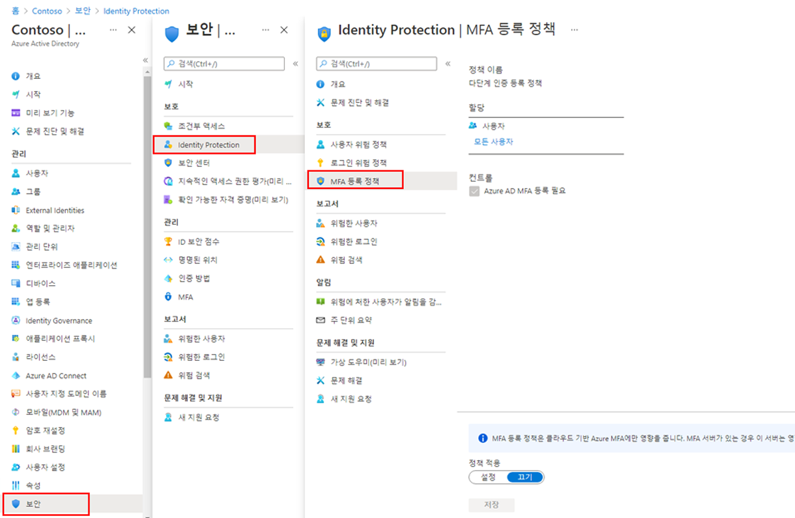

---
lab:
  title: 19 - Azure AD 다단계 인증 등록 정책 구성
  learning path: "02"
  module: Module 02 - Implement an Authentication and Access Management Solution
ms.openlocfilehash: 85aabb3ebb4f2b6a8261e6f804c536e7e6f5c3f9
ms.sourcegitcommit: 448f935ad266989a6f0086019e0c0e0785ad162b
ms.translationtype: HT
ms.contentlocale: ko-KR
ms.lasthandoff: 02/10/2022
ms.locfileid: "138421326"
---
# 랩 19 - Azure AD Multi-Factor Authentication 등록 정책 구성

## 랩 시나리오

Azure AD Multi-Factor Authentication은 사용자 이름과 암호 이외에 추가 기능을 사용하는 사용자를 확인하는 수단을 제공합니다. MFA는 사용자 로그인에 두 번째 보안 계층을 제공합니다. 사용자가 MFA 프롬프트에 응답할 수 있으려면 먼저 Azure AD Multi-Factor Authentication에 등록해야 합니다. Azure AD 조직의 MFA 등록 정책이 모든 사용자에게 할당되도록 구성해야 합니다.

#### 예상 소요 시간: 5분

### 연습 1 - MFA 등록 정책 설정

#### 작업 - 정책 구성

1. 전역 관리자 계정을 사용하여 [https://portal.azure.com]( https://portal.azure.com)에 로그인합니다.

2. 포털 메뉴를 열고 **Azure Active Directory** 를 선택합니다.

3. Azure Active Directory 블레이드의 **관리** 에서 **보안** 을 선택합니다.

4. 보안 블레이드의 왼쪽 탐색 영역에서 **Identity Protection** 을 선택합니다.

5. Identity Protection 블레이드의 왼쪽 탐색 영역에서 **MFA 등록 정책** 을 선택합니다.

    

6. **할당** 에서

7. **할당** 에서 **모든 사용자** 를 선택하고 사용 가능한 옵션을 검토합니다.

8. 롤아웃을 제한하는 경우 **모든 사용자** 또는 **개인 및 그룹 선택** 에서 선택할 수 있습니다.

9. 또한 정책에서 사용자를 제외하도록 선택할 수 있습니다.

10. **컨트롤** 에서 **Azure AD MFA 등록 필요** 가 선택되어 있고 변경할 수 없음을 알 수 있습니다.

11. **정책 적용** 에서 **켜기** 를 선택한 다음, **저장** 을 선택합니다.
