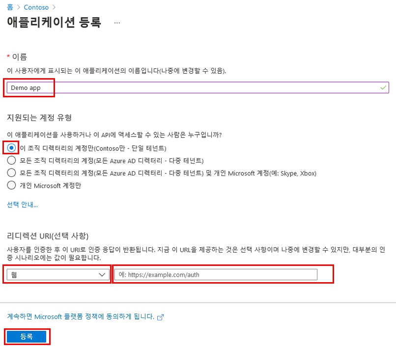
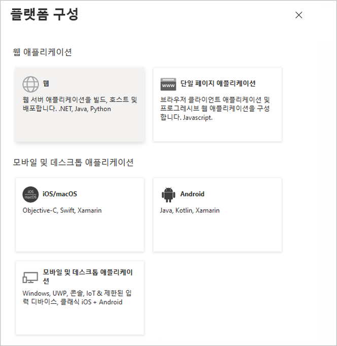
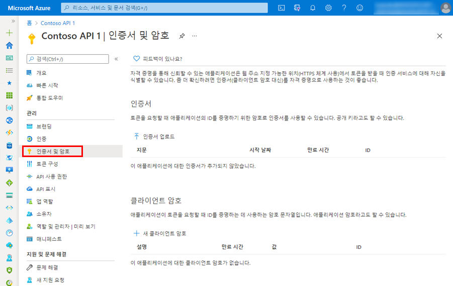
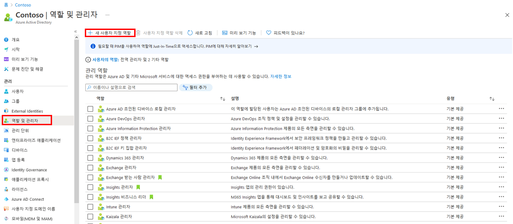
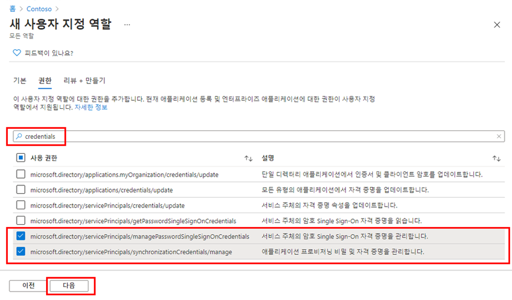

---
lab:
  title: 19 - 애플리케이션 등록
  learning path: '03'
  module: Module 03 - Implement Access Management for Apps
---

# 랩 19 - 애플리케이션 등록

### 로그인 유형 = Microsoft 365 관리

#### 예상 소요 시간: 30분

### 연습 1 - 애플리케이션 등록

#### 작업 1 - 앱 등록

애플리케이션을 등록하면 앱과 Microsoft ID 플랫폼 간에 신뢰 관계가 설정됩니다. 트러스트는 단방향입니다. 앱이 Microsoft ID 플랫폼을 신뢰하지만 Microsoft ID 플랫폼이 앱을 신뢰하는 것은 아닙니다.

1. 전역 관리자 계정을 사용하여 [https://entra.microsoft.com](https://entra.microsoft.com)  에 로그인합니다.

2. 포털 메뉴를 열고  **Microsoft Entra ID**를 선택합니다.

3. **ID 메뉴**의 **애플리케이션**에서 **앱 등록**을 선택합니다.

4. **앱 등록** 페이지의 메뉴에서 **새 등록**을 선택합니다.

5. **애플리케이션 등록** 블레이드에서 기본값을 사용하여 **Demo app**이라는 앱을 등록합니다. 리디렉션 URI를 입력할 필요가 없습니다.

    

6. **등록** 단추를 선택합니다.

7. 완료되면 **Demo app** 페이지로 이동됩니다.

#### 작업 2 - 플랫폼 설정 구성

리디렉션 URI를 포함한 각 애플리케이션 유형 설정은 Azure Portal의 **플랫폼 구성** 에서 구성할 수 있습니다.  **웹** 및 **단일 페이지 애플리케이션**과 같은 일부 플랫폼에서는 리디렉션 URI를 수동으로 지정해야 합니다. 모바일 및 데스크톱과 같은 다른 플랫폼의 경우 다른 설정을 구성할 때 생성된 리디렉션 URI에서 선택할 수 있습니다.

대상으로 하는 플랫폼 또는 디바이스에 따라 애플리케이션 설정을 구성하려면 다음을 수행합니다.

플랫폼 설정을 구성하여 등록된 애플리케이션에 대한 리디렉션 URI를 추가하고 수정합니다.

1. Microsoft Entra 관리 센터의  **앱 등록**에서 애플리케이션을 선택합니다.

2.  **관리**에서 **인증**을 선택합니다.

3.  **플랫폼 구성**에서 **+ 플랫폼 추가**를 선택합니다.

4.  **플랫폼 구성**에서 애플리케이션 유형(플랫폼)에 대한 타일을 선택하여 설정을 구성합니다.

    

    | 플랫폼| 구성 설정|
    | :--- | :--- |
    | 웹| 앱의 **리디렉션 URI** 을 입력합니다. 리디렉션 URI 는 Microsoft ID 플랫폼이 사용자의 클라이언트를 리디렉션하고 인증 후 보안 토큰을 보내는 위치입니다. 서버에서 실행되는 표준 웹 애플리케이션의 경우 이 플랫폼을 선택합니다.|
    | 단일 페이지 애플리케이션| 앱의 **리디렉션 URI** 을 입력합니다. 리디렉션 URI 는 Microsoft ID 플랫폼이 사용자의 클라이언트를 리디렉션하고 인증 후 보안 토큰을 보내는 위치입니다. JavaScript 또는 프레임워크(예: Angular, Vue.js, React.js 또는 Blazor WebAssembly)를 사용하여 클라이언트 쪽 웹앱을 빌드하는 경우 이 플랫폼을 선택합니다.|
    | iOS/macOS|  *Info.plist*  또는 빌드 설정의 XCode에 있는 앱 **번들 ID**를 입력합니다. 번들 ID를 지정하면 리디렉션 URI가 생성됩니다.|
    | Android| AndroidManifest.xml 파일에서 찾을 수 있는 앱 **패키지 이름**을 입력하고, **서명 해시**를 생성하고 입력합니다. 이러한 설정을 지정하면 리디렉션 URI가 생성됩니다.|
    | 모바일 및 데스크톱 애플리케이션|  **제안된 리디렉션 URI** 중 하나를 선택하거나 **사용자 지정 리디렉션 URI**를 지정합니다. 데스크톱 애플리케이션의 경우 [https://login.microsoftonline.com/common/oauth2/nativeclient](https://login.microsoftonline.com/common/oauth2/nativeclient)를 권장합니다. 최신 MSAL(Microsoft 인증 라이브러리)을 사용하지 않거나 broker를 사용하지 않는 모바일 애플리케이션의 경우 이 플랫폼을 선택합니다. 데스크톱 애플리케이션의 경우에도 이 플랫폼을 선택합니다.|

5. 플랫폼으로 **웹**을 선택합니다.

6. 리디렉션 URI에 `https://localhost`을(를) 입력합니다.

7.  **구성** 을 선택하여 플랫폼 구성을 완료합니다.

#### 작업 3 - 자격 증명, 인증서, 클라이언트 비밀 추가

자격 증명은 웹 API에 액세스하는 기밀 클라이언트 애플리케이션에서 사용됩니다. 기밀 클라이언트의 예로 웹앱, 다른 웹 API, 서비스 유형과 디먼 유형 애플리케이션이 있습니다. 자격 증명을 사용하면 애플리케이션에서 자체적으로 인증할 수 있으므로 런타임에 사용자의 상호 작용이 필요하지 않습니다.

인증서와 클라이언트 암호(문자열)를 모두 자격 증명으로 기밀 클라이언트 앱 등록에 추가할 수 있습니다.



    **Note**: Sometimes called a *public key*, certificates are the recommended credential type, because as they provide a higher level of assurance than a client secret. When using a trusted public certificate, you can add the certificate using the Certificates & secrets feature. Your certificate must be one of the following file types: .cer, .pem, .crt.


    **Note**: The client secret, also known as an *application password*, is a string value your app can use in place of a certificate to identity itself. It's the easier of the two credential types to use. It's often used during development, but is considered less secure than a certificate. You should use certificates in your applications running in production.

1. Azure Portal의 **앱 등록** 에서 애플리케이션을 선택합니다.

2.  **인증서 및 비밀**을 선택한 다음, **+ 새 클라이언트 암호**를 선택합니다.

3. 클라이언트 암호 및 기간에 대한 설명을 추가합니다.

 - 설명 = SC300 랩 비밀
 - 기간 = 90일(3개월)

4.  **추가**를 선택합니다.

5. 클라이언트 애플리케이션 코드에서 사용할 **비밀 값을 메모장에 저장** 합니다. 인증서 및 비밀 페이지에 새 비밀 값이 표시됩니다. 이 값은 한 번만 표시되므로 복사하는 것이 중요합니다. 페이지를 새로 고치고 돌아오면 마스킹된 값으로만 표시됩니다.

웹앱이 등록되면 API 코드가 API 소비자에게 세분화된 권한을 제공하는 데 사용할 수 있는 범위를 추가할 준비가 된 것입니다.

#### 작업 5 - 범위 추가

클라이언트 애플리케이션의 코드는 보호된 리소스(웹 API)에 대한 요청과 함께 액세스 토큰을 전달하여 웹 API에서 정의한 작업을 수행할 권한을 요청합니다. 그런 다음, 웹 API는 수신한 액세스 토큰에 작업에 필요한 범위(애플리케이션 권한이라고도 함)가 포함되어 있는 경우에만 요청된 작업을 수행합니다.

먼저 다음 단계를 수행하여 Employees.Read.All이라는 예제 범위를 생성합니다.

1.  **ID**를 선택한 다음 **애플리케이션** 을 선택하고 마지막으로  **앱 등록**을 선택한 다음 API의 앱 등록을 선택합니다.

2.  **API 표시**를 선택한 다음, **+ 범위 추가**를 선택합니다.

    ![Azure Portal에 있는 앱 등록의 [API 표시] 창](./media/portal-02-expose-api.png)

3.  **애플리케이션 ID URI**를 설정하라는 메시지가 표시됩니다. 값을 **api://DemoAppAPI**로 설정합니다.

  - 참고 - 앱 ID URI는 API 코드에서 참조할 범위의 접두사 역할을 하며 전역적으로 고유해야 합니다. api://<application-client-id\> 형식으로 제공되는 기본값을 사용해도 되고  `https://contoso.com/api` 같이 더 읽기 쉬운 URI를 지정해도 됩니다.

4. **저장하고 계속**을 선택합니다.

5. 다음으로, **범위 추가 창**에서 범위 특성을 지정합니다. 이 연습에서는 세 번째 열인 **Value**에 있는 값을 사용합니다.

    | 필드| 설명| 값 |
    | :--- | :--- | :--- |
    | 범위 이름| 범위의 이름입니다. 일반적인 범위 명명 규칙은 resource.operation.constraint입니다.| Employees.Read.All|
    | 동의할 수 있는 사람| 이 범위를 사용자가 동의할 수 있는지 아니면 관리자 동의가 필요한지 여부를 지정합니다. 높은 권한을 적용하려면 관리자만을 선택합니다.| 관리자 및 사용자|
    | 관리자 동의 표시 이름| 범위의 목적에 대한 간단한 설명으로 관리자에게만 표시됩니다.| 직원 레코드에 대한 읽기 전용 액세스|
    | 관리자 동의 설명| 범위에서 부여하는 권한에 대한 자세한 설명으로 관리자에게만 표시됩니다.| 애플리케이션이 모든 직원 데이터에 대해 읽기 전용 액세스 권한을 갖도록 허용합니다.|
    | 사용자 동의 표시 이름| 범위의 목적에 대한 간단한 설명입니다. 동의할 수 있는 사람을 관리자 및 사용자로 설정한 경우에만 사용자에게 표시됩니다.| 직원 레코드에 대한 읽기 전용 액세스|
    | 사용자 동의 설명| 범위에서 부여하는 권한에 대한 자세한 설명입니다. 동의할 수 있는 사람을 관리자 및 사용자로 설정한 경우에만 사용자에게 표시됩니다.| 애플리케이션이 직원 데이터에 대해 읽기 전용 액세스 권한을 갖도록 허용합니다.|

7.  **상태** 를 **사용**으로 설정한 다음, **범위 추가**를 선택합니다.

8. (선택 사항)관리자가 정의한 범위에 동의하도록 요청하는 메시지를 앱 사용자에게 표시하지 않으려면 웹 API에 액세스하도록 클라이언트 애플리케이션에미리 권한을 부여 하면 됩니다. ** 사용자에게는 동의를 거부할 기회가 없기 때문에 신뢰할 수 있는 클라이언트 애플리케이션에만  미리 권한을 부여해야 합니다. **

   1.  **권한 있는 클라이언트 애플리케이션**에서, **클라이언트 애플리케이션 추가**를 선택합니다.

   2. 미리 권한을 부여하려는 클라이언트 애플리케이션의 **애플리케이션(클라이언트) ID** 를 입력합니다. 예를 들어 앞에서 등록한 웹 애플리케이션의 ID를 입력합니다.

   3.  **권한 있는 모든 범위**에서 동의 메시지를 표시하지 않을 범위를 선택한 다음, **애플리케이션 추가**를 선택합니다.

   4. 이 선택 사항을 수행한 경우 클라이언트 앱은 이제 PCA(미리 권한이 부여된 클라이언트 앱)이며, 사용자가 클라이언트 앱에 로그인할 때 동의 여부를 묻는 메시지가 표시되지 않습니다.

#### 작업 6 - 관리자 동의가 필요한 범위 추가

다음으로 관리자만 동의할 수 있는 다른 예제 범위 Employees.Write.All을 추가합니다. 관리자 동의가 필요한 범위는 일반적으로 더 높은 권한이 있는 작업에 대한 액세스를 제공하는 데 사용되며, 사용자가 대화형으로 로그인하지 않는 백 엔드 서비스 또는 디먼으로 실행되는 클라이언트 애플리케이션을 통해 제공되는 경우가 많습니다.

1. Employees.Write.All 예제 범위를 추가하려면, 위 단계를 수행하고 **범위 추가** 창에서 다음 값을 지정합니다.

    | 필드| 예제 값|
    | :--- | :--- |
    | 범위 이름| Employees.Write.All|
    | 동의할 수 있는 사람| 관리자 전용|
    | 관리자 동의 표시 이름| 직원 레코드에 대한 쓰기 권한|
    | 관리자 동의 설명| 애플리케이션이 모든 직원 데이터에 대해 쓰기 액세스 권한을 갖도록 허용합니다.|
    | 사용자 동의 표시 이름| 없음(비워 둠)|
    | 사용자 동의 설명| 없음(비워 둠)|

2. 상태가 **사용**으로 설정되어 있는지 확인한 다음 **범위 추가**를 선택합니다.

  - **참고**: 이전 섹션에서 설명한 예제 범위 두 가지를 모두 성공적으로 추가했다면 다음 이미지처럼 웹 API 앱 등록의 **API 표시** 창에 두 범위가 표시됩니다.

  ![두 범위를 표시하는 [API 표시] 창의 스크린샷](./media/portal-03-scopes-list.png)

  이미지에 표시된 것처럼 범위의 전체 문자열은 웹 API의 **애플리케이션 ID URI** 와 범위의 **범위 이름**을 연결한 것입니다.

  **참고**: 예를 들어 웹 API의 애플리케이션 ID URI가 `https://contoso.com/api` 이고 범위 이름이 Employees.Read.All이면 전체 범위는 `https://contoso.com/api/Employees.Read.All`입니다.

  **참고**: 다음으로, 위 단계를 수행하여 정의한 웹 API에 대한 액세스 권한과 정의한 범위를 사용하여 클라이언트 앱의 등록을 구성합니다.
  클라이언트 앱 등록에 웹 API에 대한 액세스 권한이 부여되면 클라이언트에서 Microsoft ID 플랫폼을 통해 OAuth 2.0 액세스 토큰을 발급할 수 있습니다. 클라이언트는 웹 API를 호출할 때, 클라이언트의 앱 등록에 지정된 권한으로 범위(scp) 클레임이 설정된 액세스 토큰을 제공합니다. 추가 범위를 나중에 필요한 대로 노출할 수 있습니다. 웹 API는 여러 작업에 연결된 여러 범위를 공개할 수 있습니다. 리소스는 수신하는 OAuth 2.0 액세스 토큰의 범위(scp) 클레임을 평가하여 런타임에 웹 API에 대한 액세스를 제어할 수 있습니다.


### 연습 2 - 사용자 지정 역할로 앱 등록 관리

#### 작업 1 - 앱 등록 관리에 대한 액세스 권한을 부여하는 새 사용자 지정 역할 만들기

앱 관리를 위한 새로운 사용자 지정 역할을 만들어야 합니다. 이 새로운 역할은 자격 증명 관리를 수행하는 데 필요한 특정 권한에만 제한되어야 합니다.

1. 전역 관리자 계정을 사용하여 [https://entra.microsoft.com](https://entra.microsoft.com)  에 로그인합니다.

2. 포털 메뉴를 열고  **Microsoft Entra ID**를 선택합니다.

3. 왼쪽 메뉴의 **ID**에서 **역할 및 관리자**를 선택합니다.

4. 그런 다음 **역할 및 관리자** 항목을 선택한 다음 **+ 새 사용자 지정 역할**을 선택합니다.

    

5. 새 사용자 지정 역할 대화의 기본 정보 탭에 있는 이름 상자에 **내 사용자 지정 앱 역할**을 입력합니다.

6. 나머지 옵션을 검토하고 **다음**을 선택합니다.

7. 사용 권한 탭에서 사용 가능한 권한을 검토합니다.

8. **권한 이름 또는 설명으로 검색** 상자에 **자격 증명**을 입력합니다.

9. 결과에서 권한 **관리**를 선택하고 **다음**을 선택합니다.

    ```
       microsoft.directory/servicePrincipals/managePasswordSingleSignOnCredentials  -   Manage password single sign-on credentials or service principals.
       microsoft.directory/servicePrincipals/synchronizationCredentials/manage    -   Manage application provisioning secrets and credentials.
    ```

    

    **이 두 가지 권한을 선택하는 이유** - 애플리케이션을 프로비저닝할 때 만드는 애플리케이션 또는 서비스 주체를 대상으로 SSO(Single-Sign-On)를 사용하도록 설정하고 적용할 때, 그리고 특정 사용자 또는 그룹 집합에 엔터프라이즈 애플리케이션을 할당할 때 필요한 최소 권한이 이 두 항목이기 때문입니다.  다른 권한도 부여할 수 있습니다.  `https://docs.microsoft.com/azure/active-directory/roles/custom-enterprise-app-permissions`에서 사용 가능한 사용 권한의 전체 목록을 가져올 수 있습니다.

10. **다음**을 선택합니다.

11. 변경을 검토한 후 **생성**을 선택합니다.

