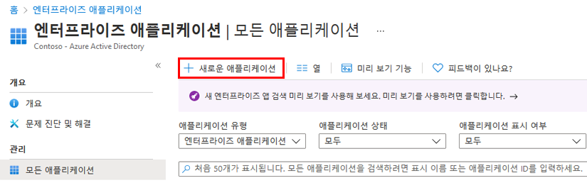
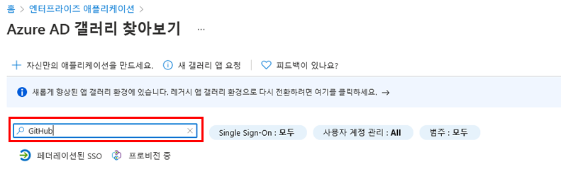
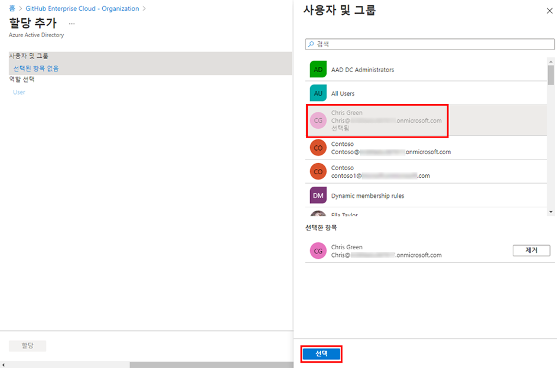

---
lab:
  title: 20 - 앱을 위한 액세스 관리 구현
  learning path: '03'
  module: Module 03 - Implement Access Management for Apps
---

# 랩 20 - 앱을 위한 액세스 관리 구현

## 랩 시나리오

조직에서는 특정 사용자 또는 그룹만 엔터프라이즈 애플리케이션에 액세스할 수 있도록 할 것을 요구합니다. 사용자를 특정 애플리케이션에 할당해야 합니다.

#### 예상 소요 시간: 5분

### 연습 1 - 엔터프라이즈 앱 구성

#### 작업 1 - Microsoft Entra 테넌트에 앱 추가

1. 전역 관리자 계정을 사용하여 [https://entra.microsoft.com](https://entra.microsoft.com)  에 로그인합니다.

2. 포털 메뉴를 열고  **Microsoft Entra ID**를 선택합니다.

3. ID 메뉴의 **애플리케이션**에서 **엔터프라이즈 애플리케이션**을 선택합니다.

4. 엔터프라이즈 애플리케이션 창에서 **새 애플리케이션**을 선택합니다.

    

5. Microsoft Entra 갤러리 찾아보기 페이지의 **애플리케이션 검색** 상자에 **GitHub**를 입력합니다.

    

6. 결과에서 **GitHub Enterprise Cloud – 엔터프라이즈 계정**을 선택합니다.

7. **GitHub Enterprise Cloud – 엔터프라이즈 계정**에서 설정을 검토한 다음 **생성**를 선택합니다.

8. 계정이 만들어지면 GitHub Enterprise Cloud – 엔터프라이즈 계정 페이지로 리디렉션됩니다.

#### 작업 2 - 앱에 사용자 할당

1. GitHub Enterprise Cloud – 엔터프라이즈 계정 페이지의 개요 페이지에 있는 **시작하기**에서 **1을 선택합니다. 사용자 및 그룹 할당**

2. 또는 왼쪽 탐색의 **관리**에서 **사용자 및 그룹**을 선택할 수 있습니다.

3. 사용자 및 그룹 페이지의 메뉴에서 **+사용자/그룹 추가**를 선택합니다.

4. 할당 추가 페이지의 **사용자 및 그룹** 섹션에서 **선택한 항목 없음**을 선택합니다.

5. 사용자 및 그룹 창에서 관리자 계정을 선택한 다음 **선택**을 선택합니다.

    

6. **할당**을 선택합니다.

