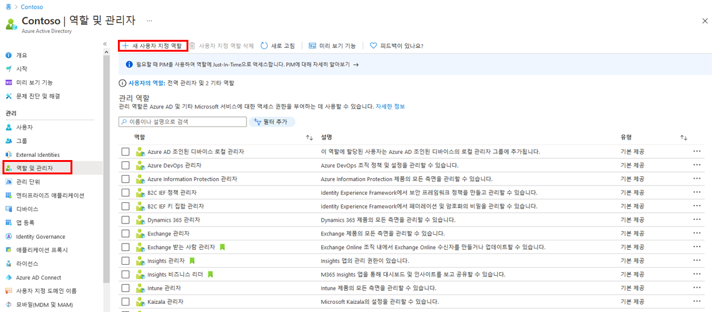
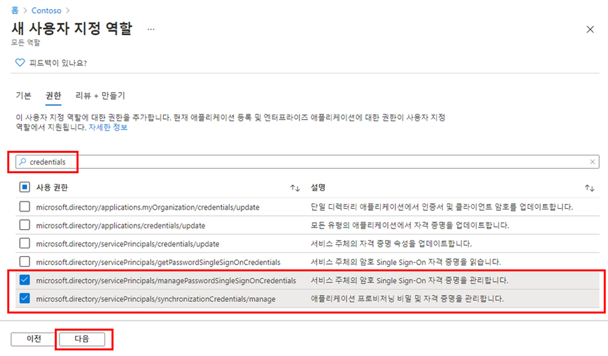

---
lab:
  title: 21 - 앱 등록 관리에 대한 액세스 권한을 부여하는 새 사용자 지정 역할 만들기
  learning path: "03"
  module: Module 03 - Implement Access Management for Apps
ms.openlocfilehash: a33acee3b79aeb2324777e68c64fd5bdea830753
ms.sourcegitcommit: 448f935ad266989a6f0086019e0c0e0785ad162b
ms.translationtype: HT
ms.contentlocale: ko-KR
ms.lasthandoff: 02/10/2022
ms.locfileid: "138421329"
---
# <a name="lab-21---create-a-custom-role-to-manage-app-registration"></a>랩 21 - 앱 등록을 관리하는 사용자 지정 역할 만들기

## <a name="lab-scenario"></a>랩 시나리오

앱 관리를 위한 새로운 사용자 지정 역할을 만들어야 합니다. 이 새로운 역할은 자격 증명 관리를 수행하는 데 필요한 특정 권한에만 제한되어야 합니다.

#### <a name="estimated-time-5-minutes"></a>예상 소요 시간: 5분

### <a name="exercise-1---manage-app-registration-with-a-custom-role"></a>연습 1 - 사용자 지정 역할로 앱 등록 관리

#### <a name="task---create-a-new-custom-role-to-grant-access-to-manage-app-registrations"></a>작업 - 앱 등록 관리에 대한 액세스 권한을 부여하는 새 사용자 지정 역할 만들기

1. 전역 관리자 계정을 사용하여 [https://portal.azure.com](https://portal.azure.com)에 로그인합니다.

2. 포털 메뉴를 열고 **Azure Active Directory** 를 선택합니다.

3. Azure Active Directory 블레이드의 **관리** 에서 **역할 및 관리자** 를 선택합니다.

4. 역할 및 관리자 블레이드의 메뉴에서 **+새 사용자 지정 역할** 을 선택합니다.

    

5. 새 사용자 지정 역할 블레이드의 기본 정보탭에 있는 이름 상자에 **내 사용자 지정 앱 역할** 을 입력합니다.

6. 나머지 옵션을 검토하고 **다음** 을 선택합니다.

7. 사용 권한 탭에서 사용 가능한 권한을 검토합니다.

8. **권한 이름 또는 설명으로 검색** 상자에 **자격 증명** 을 입력합니다.

9. 결과에서 권한 **관리** 를 선택하고 **다음** 을 선택합니다.

    ```
       microsoft.directory/servicePrincipals/managePasswordSingleSignOnCredentials  -   Manage password single sign-on credentials or service principals.
       microsoft.directory/servicePrincipals/synchronizationCredentials/manage    -   Manage application provisioning secrets and credentials.
    ```

    

    **이 두 가지 권한을 선택하는 이유** - 애플리케이션을 프로비저닝할 때 만드는 애플리케이션 또는 서비스 주체를 대상으로 SSO(Single-Sign-On)를 사용하도록 설정하고 적용할 때, 그리고 특정 사용자 또는 그룹 집합에 엔터프라이즈 애플리케이션을 할당할 때 필요한 최소 권한이 이 두 항목이기 때문입니다.  다른 권한도 부여할 수 있습니다.  `https://docs.microsoft.com/azure/active-directory/roles/custom-enterprise-app-permissions`에서 사용 가능한 사용 권한의 전체 목록을 가져올 수 있습니다.

10. 변경을 검토한 후 **생성** 을 선택합니다.
