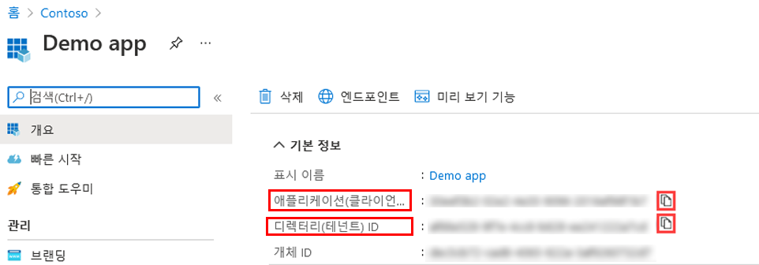
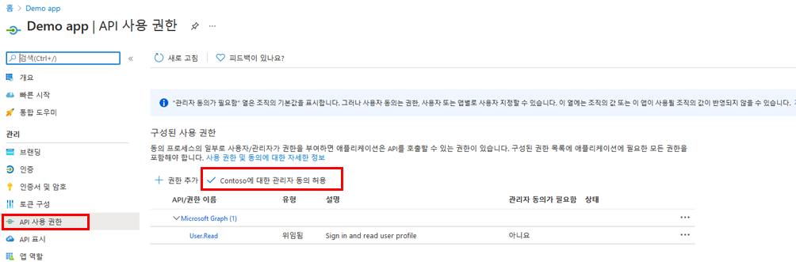
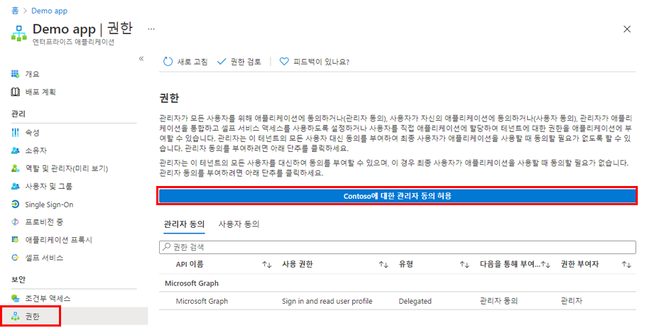
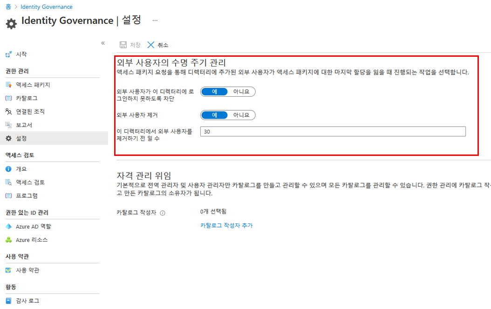

---
lab:
  title: 21 - 애플리케이션에 대한 테넌트 전체 관리자 동의 부여
  learning path: "03"
  module: Module 03 - Implement Access Management for Apps
ms.openlocfilehash: 6618f481c5e25496aef4c5b688976dde9d74cffa
ms.sourcegitcommit: 80c5c0ef60c1d74fcc58c034fe6be67623013cc0
ms.translationtype: HT
ms.contentlocale: ko-KR
ms.lasthandoff: 07/01/2022
ms.locfileid: "146823231"
---
# 랩 21: 애플리케이션에 대한 테넌트 전체 관리자 동의 부여

## 랩 시나리오

조직에서 개발한 애플리케이션 또는 Azure AD 테넌트에 직접 등록된 애플리케이션의 경우 Azure Portal에서 앱 등록의 테넌트 전체 관리자 동의를 부여할 수 있습니다.

#### 예상 소요 시간: 15분

### 연습 1 - 관리자 동의

#### 작업 1 - 앱 등록에서 관리자 동의 부여

   **경고** - 애플리케이션에 테넌트 전체 관리자 동의를 부여하면 앱과 앱 게시자에게 조직의 데이터에 대한 액세스 권한이 부여됩니다. 동의를 부여하기 전에 애플리케이션에서 요청하는 권한을 신중하게 검토합니다.

전역 관리자 역할은 Microsoft Graph API에 대한 애플리케이션 권한에 대한 관리자 동의를 제공하기 위해 필요합니다.

1. 이전 연습에서는 Demo app이라는 앱을 만들었습니다. 필요한 경우 Microsoft Azure에서 **Azure Active Directory** 로 이동한 다음, **앱 등록** 을 선택한 다음, **데모 앱** 을 선택합니다.

2. **데모 앱** 페이지에서 나중에 사용할 수 있도록 각 **애플리케이션(클라이언트) ID** 및 **디렉터리(테넌트) ID** 값을 찾아서 복사하고 저장합니다.

    >**참고**: **데모 앱** 은 이전 실습에서 생성되었습니다. 이 랩 전에 이러한 랩을 완료하세요.

    

3. 왼쪽 탐색 영역의 **관리** 에서 **API 권한** 을 선택합니다.

4. **구성된 사용 권한** 에서 **관리자 동의 허용** 을 선택합니다.

    

5. 대화 상자를 검토한 다음 **예** 를 선택합니다.

   **경고** - 앱 등록을 통해 테넌트 전체 관리자 동의를 부여하면 이전에 테넌트 전체에 부여된 모든 권한이 해지됩니다. 사용자가 이전에 대신 부여 받은 사용 권한은 영향을 받지 않습니다.

#### 작업 2 - 엔터프라이즈 앱에서 관리자 동의 부여

애플리케이션이 테넌트에 이미 프로비저닝된 경우 엔터프라이즈 애플리케이션을 통해 테넌트 전체 관리자 동의를 부여할 수 있습니다.

1. Microsoft Azure에서 **Azure Active Directory > 엔터프라이즈 애플리케이션 > Demo app** 으로 이동합니다.

2. **데모 앱** 페이지의 왼쪽 탐색 영역에 있는 **보안** 아래에서 **사용 권한** 을 선택합니다.

3. **사용 권한** 에서 **관리자 동의 허용** 을 선택합니다.

    

   **경고** - 앱 등록을 통해 테넌트 전체 관리자 동의를 부여하면 이전에 테넌트 전체에 부여된 모든 권한이 해지됩니다. 사용자가 이전에 대신 부여 받은 사용 권한은 영향을 받지 않습니다.

4. 메시지가 표시되면 전역 관리자 계정을 사용하여 로그인합니다.

5. **사용 권한 요청됨** 대화 상자에서 정보를 검토한 다음 **동의** 를 선택합니다.

### 연습 2 - Azure AD Identity Governance 설정

#### 작업 1 - Azure AD Identity Governance 설정에서 외부 사용자의 수명 주기 관리

승인된 액세스 패키지 요청을 통해 디렉터리에 초대된 외부 사용자가 더 이상 액세스 패키지 할당을 보유하지 않는 경우 수행할 작업을 선택할 수 있습니다. 사용자가 모든 액세스 패키지 할당을 포기하거나 마지막 액세스 패키지 할당이 만료되는 경우 이 상황이 발생할 수 있습니다. 외부 사용자에게 더 이상 액세스 패키지 할당이 없는 경우 기본값으로 디렉터리에 로그인하지 못하도록 차단됩니다. 30일 후에는 해당 게스트 사용자 계정이 디렉터리에서 제거됩니다.

1. 전역 관리자로 [https://portal.azure.com](https://portal.azure.com)에 로그인합니다.

2. 해당 작업을 완료하려면 전역 관리자 또는 사용자 관리자 권한이 있는 계정이 필요합니다.

3. Azure Active Directory를 열고 **ID 거버넌스** 를 선택합니다.

4. 왼쪽 탐색 메뉴의 **권한 관리** 에서 **설정** 을 선택합니다.

5. 상단 메뉴에서 **편집** 을 선택합니다.

    

6. **외부 사용자의 수명 주기 관리** 섹션에서 외부 사용자에 대한 다양한 설정을 검토합니다.

7. 외부 사용자가 액세스 패키지에 대한 마지막 할당을 상실한 경우 이 디렉터리에 로그인하지 못하도록 차단하려면 **외부 사용자가 이 디렉터리에 로그인하지 못하도록 차단** 을 **예** 로 설정합니다.

    **참고** - 사용자가 디렉터리에 로그인하지 못하도록 차단되면 사용자는 액세스 패키지를 다시 요청하거나 해당 디렉터리에서 추가 액세스를 요청할 수 없습니다. 나중에 사용자가 다른 액세스 패키지에 대한 액세스 권한을 요청해야 하는 경우에는 사용자의 로그인을 차단하도록 구성하지 마세요.

9. 외부 사용자가 액세스 패키지에 대한 마지막 할당을 상실한 후 이 디렉터리에서 게스트 사용자 계정을 제거하려면 **외부 사용자 제거** 를 **예** 로 설정합니다.

    **참고** - 권한 관리는 권한 관리를 통해 초대된 계정만 제거합니다. 또한 액세스 패키지 할당이 아닌 디렉터리의 리소스에 사용자가 추가된 경우에도 사용자는 로그인하지 못하도록 차단되며 디렉터리에서 제거됩니다. 게스트는 액세스 패키지 할당을 받기 전에 이 디렉터리에 있는 경우 유지됩니다. 그러나 게스트가 액세스 패키지 할당을 통해 초대되고 초대된 후에 비즈니스용 OneDrive 또는 SharePoint Online 사이트에 할당된 경우에도 제거됩니다.

10. 해당 디렉터리에서 게스트 사용자 계정을 제거하려면 제거 전 일 수를 설정할 수 있습니다. 액세스 패키지에 대한 마지막 할당을 잃는 즉시 게스트 사용자 계정을 제거하려면 **해당 디렉터리에서 외부 사용자를 제거하기 전까지 남은 일 수** 를 **0** 으로 설정합니다.

11. 변경한 경우 **저장** 을 선택합니다.
