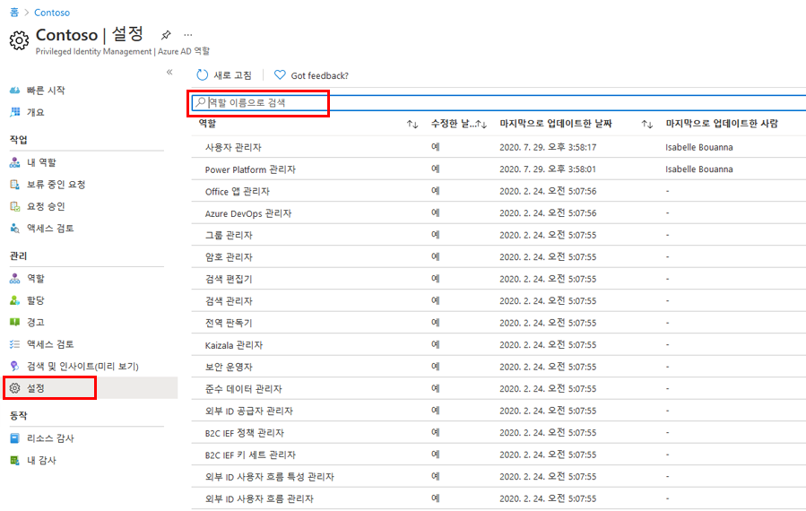
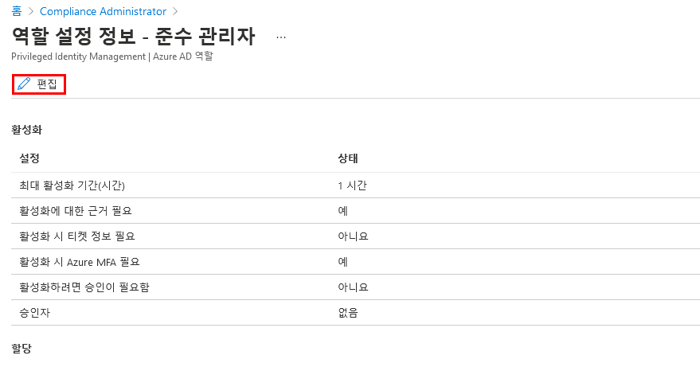
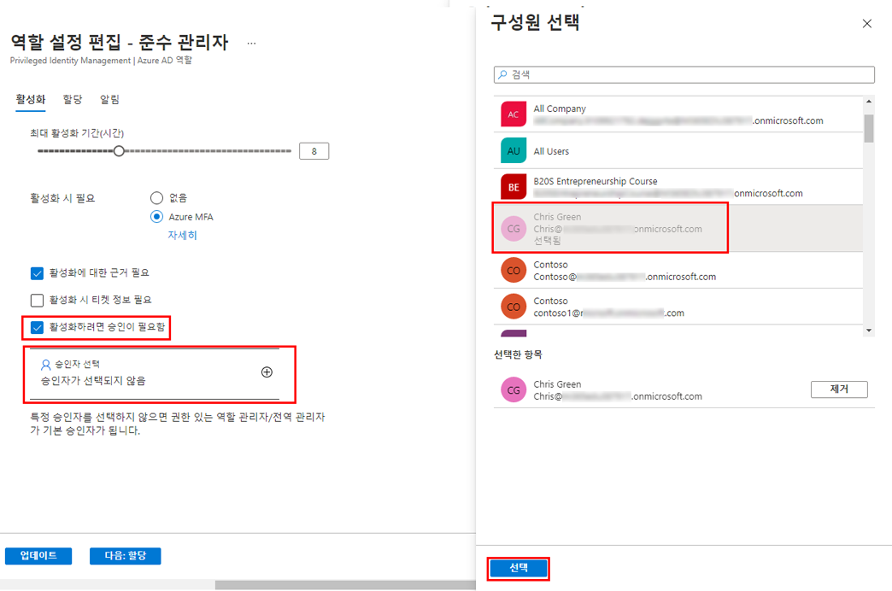
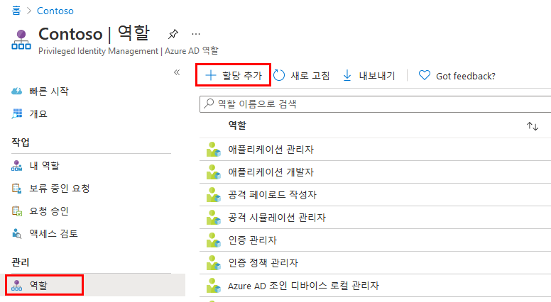
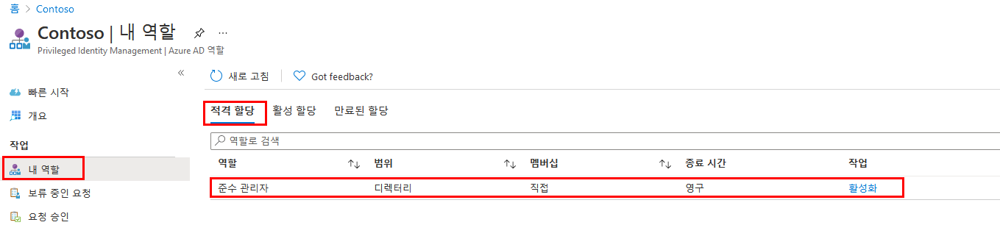
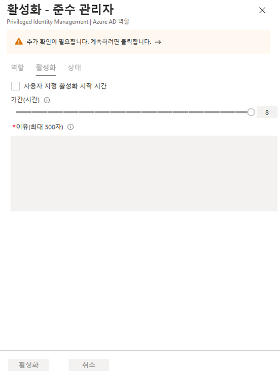

---
lab:
  title: 26 - Azure AD 역할에 대한 Privileged Identity Management 구성
  learning path: "04"
  module: Module 04 - Plan and Implement and Identity Governance Strategy
ms.openlocfilehash: 129d26f994f732e94568b2b0d69383ad4b7c3031
ms.sourcegitcommit: 80c5c0ef60c1d74fcc58c034fe6be67623013cc0
ms.translationtype: HT
ms.contentlocale: ko-KR
ms.lasthandoff: 07/01/2022
ms.locfileid: "146823240"
---
# 랩 26: Azure AD 역할에 대한 Privileged Identity Management 구성

## 랩 시나리오

권한 있는 역할 관리자는 적격 역할 할당을 활성화한 사용자의 환경을 변경하는 등, 해당 Azure Active Directory(Azure AD) 조직에서 PIM(Privileged Identity Management)을 사용자 지정할 수 있습니다. PIM을 구성하는 데 익숙해져야 합니다.

#### 예상 소요 시간: 30분

### 연습 1 - Azure AD 역할 설정 구성

#### 작업 1 - 역할 설정 열기

다음 단계에 따라 Azure AD 역할에 대한 설정을 엽니다.

1. 전역 관리자로 [https://portal.azure.com](https://portal.azure.com)에 로그인합니다.

2. 검색한 다음 **Azure AD Privileged Identity Management** 를 선택합니다.

3. 왼쪽 탐색 영역에서 Privileged Identity Management 페이지의 **Azure AD 역할** 을 선택합니다.

4. 빠른 시작 페이지의 왼쪽 탐색 영역에서 **설정** 을 선택합니다.

    

5. 역할 목록을 검토한 다음 **역할 이름으로 검색** 에서 **준수** 를 입력합니다.

6. 결과에서 **준수 관리자** 를 선택합니다.

7. 역할 설정 세부 정보를 검토합니다.

#### 작업 2 - 활성화하려면 승인 필요

여러 승인자를 설정하는 경우 승인자 중 한 명이 승인되거나 거부되는 즉시 승인이 완료됩니다. 두 명 이상의 사용자에게 승인을 요구할 수 없습니다. 역할을 활성화하기 위해 승인을 요구하려는 경우 다음 단계를 따릅니다.

1. 역할 설정 정보 페이지의 상단 메뉴에서 **편집** 을 선택합니다.

    

2. 역할 편집 설정 – 준수 관리자 페이지에서 **활성화 승인 필요** 확인란을 선택합니다.

3. **승인자 선택** 을 선택합니다.

4. 구성원 선택 창에서 관리자 계정을 선택한 다음 **선택** 을 선택합니다.

    

5. 역할 설정을 구성하면, **업데이트** 를 선택해 변경 사항을 저장합니다.

### 연습 2 - Azure AD 역할을 사용하는 PIM

#### 작업 1 - 역할 할당

전역 관리자는 Azure AD(Azure Active Directory)를 사용하여 영구 Azure AD 관리자 역할 할당을 만들 수 있습니다. 이러한 역할은 Azure Portal 또는 PowerShell 명령을 사용하여 할당할 수 있습니다.

Azure AD PIM(Privileged Identity Management) 서비스를 사용하여 권한 있는 역할 관리자는 영구 디렉터리 역할을 할당할 수도 있습니다. 또한 권한이 있는 역할 관리자는 사용자의 Azure AD 관리자 역할을 적격으로 만들 수 있습니다. 적격인 관리자는 필요할 때 역할을 활성화할 수 있으며 작업을 완료하고 나면 권한이 만료됩니다.

사용자를 Azure AD 관리자 역할에 대해 적격 사용자로 지정하려면 다음 단계를 따릅니다.

1. 전역 관리자 계정을 사용하여 [https://portal.azure.com](https://portal.azure.com)에 로그인합니다.

2. 검색한 다음 **Azure AD Privileged Identity Management** 를 선택합니다.

3. 왼쪽 탐색 영역에서 Privileged Identity Management 페이지의 **Azure AD 역할** 을 선택합니다.

4. 빠른 시작 페이지의 왼쪽 탐색 영역에서 **역할** 을 선택합니다.

5. 상단 메뉴에서 + **할당 추가** 를 선택합니다.

    

6. 할당 추가 페이지의 **멤버 자격** 탭에서 설정을 검토합니다.

7. **역할 선택** 메뉴를 선택한 다음 **준수 관리자** 를 선택합니다.

8. **이름으로 역할 검색** 필터를 사용하여 역할을 쉽게 찾을 수 있습니다.

9. **구성원 선택** 아래에서 **선택한 구성원이 없음** 을 선택합니다.

10. 구성원 선택 창에서 **Miriam Graham** 을 선택한 다음 **선택** 을 선택합니다.

    

11. 할당 추가 페이지에서 **다음** 을 선택합니다.

12. **설정** 탭의 **할당 유형** 에서 사용 가능한 옵션을 검토합니다. 해당 작업의 경우 기본 설정을 사용합니다.

    - 적격 할당에는 역할을 사용하는 작업을 수행하기 위해 역할의 멤버가 필요합니다. 작업은 MFA(Multi-Factor Authentication) 검사를 수행하고, 비즈니스 근거를 제공하거나 지정된 승인자의 승인을 요청하는 과정을 포함할 수 있습니다.
    - 활성 할당에는 역할을 사용하는 작업을 수행하기 위해 멤버가 필요하지 않습니다. 활성으로 할당된 구성원에게는 역할에 할당된 권한이 있습니다.

13. 나머지 설정을 검토하고 **할당하기** 를 선택합니다.

#### 작업 2 - Miriam으로 로그인

1. 새 InPrivate 브라우저 창을 엽니다.
2. Azure Portal에 연결(https://portal.azure.com).
3. 사용자가 로그인된 상태로 Azure Portal이 열리면 오른쪽 위에서 해당 사용자 이름을 선택하고 **다른 계정으로 로그인** 을 선택합니다.
4. Miriam으로 로그인합니다.

   | 필드 | 값 |
   | :--- | :--- |
   | 사용자 이름 | **MiriamG@** `<<your domain.onmicrosoft.com>>` |
   | 암호 |  테넌트의 관리자 암호를 입력합니다(테넌트 관리자 암호를 검색하려면 랩 리소스 탭 참조). |

5. **Azure를 시작합니다!** 대화 상자를 닫습니다.
6. **리소스, 서비스, 문서 검색** 창에서 Azure Active Directory를 검색하여 해당 페이지를 엽니다.
7. **개요** 페이지에서 **내 피드** 를 찾습니다.
8. Miriam Graham의 이름 아래에서 **프로필 보기** 를 선택합니다. 그러면 Miriam의 프로필 페이지가 열립니다.
9. **할당된 역할**, **적격 할당** 을 차례로 선택합니다.
10. 현재 Miriam에게는 **준수 관리자** 역할을 할당할 수 있습니다.

#### 작업 3 - 내 Azure AD 역할 활성화

Azure AD 역할을 가정해야 하는 경우 Privileged Identity Management에서 **내 역할** 을 열어 활성화를 요청할 수 있습니다.

1. **리소스, 서비스 및 문서 검색** 창에서 Privileged를 검색합니다.
2. **Azure AD Privileged Identity Management** 페이지를 엽니다.
3. 왼쪽 탐색 메뉴에서 Privileged Identity Management 페이지의 **내 역할** 을 선택합니다.

4. 내 역할 페이지에서 적격 할당 목록을 검토합니다.

    

5. 준수 관리자 역할 행에서 **활성화** 를 선택합니다.

6. 활성화 – 준수 관리자 창에서 **추가 인증 필요** 를 선택하고 지침에 따라 추가 보안 인증을 제공합니다. 세션당 한 번만 인증해야 합니다.

    

    **확인** - 현재 랩 환경 구성에 따라 MFA를 구성하여 정상적으로 로그인해야 합니다.

7. 추가 보안 인증을 완료한 후에 활성화 – 준수 관리자 창의 **이유** 상자에 **해당 역할을 활성화하기 위한 근거입니다.** 를 입력합니다.

    **중요 참고 사항** - 최소 권한 원칙에 따라 필요한 시간 동안만 계정을 활성화해야 합니다.  완료해야 하는 작업의 소요 시간이 1.5시간이라면 계정 활성화 기간을 2시간으로 설정합니다.  마찬가지로 오후 3시까지는 작업을 수행할 수 없다면 사용자 지정 활성화 시간을 선택합니다.

8. **활성화** 를 선택합니다.

#### 작업 4 - 제한된 범위의 역할 할당

특정 역할의 경우 부여된 사용 권한의 범위는 단일 관리 단위, 서비스 주체 또는 애플리케이션으로 제한될 수 있습니다. 이 절차는 관리 단위의 범위를 포함하는 역할을 할당하는 경우의 예입니다.

1. MiriamG로 로그인된 브라우저 창을 닫고 관리자 계정으로 Azure Portal을 열어야 합니다.
2. Privileged Identity Management 페이지로 이동하여 왼쪽 탐색 메뉴에서 Azure **Azure AD 역할** 을 선택합니다.
3. **역할** 을 선택합니다.
4. 역할 페이지의 상단 메뉴에서 **+ 할당 추가** 를 선택합니다.

5. 할당 추가 페이지에서 **역할 선택** 메뉴를 선택한 다음, **사용자 관리자** 를 선택합니다.

6. **범위 유형** 메뉴를 선택하고 사용 가능한 옵션을 검토합니다. 이제 **디렉터리** 범위 유형을 사용합니다.

   **팁** - 관리 단위 범위 유형에 대한 자세한 내용을 보려면 [https://docs.microsoft.com/en-us/azure/active-directory/roles/admin-units-manage](https://docs.microsoft.com/en-us/azure/active-directory/roles/admin-units-manage)로 이동하세요.

7. 제한된 범위 없이 역할을 할당할 때와 마찬가지로 구성원을 추가하고 설정 옵션을 완료합니다. 이제 **취소** 를 선택합니다.

#### 작업 5 - 기존 역할 할당 업데이트 또는 제거

기존 역할 할당을 업데이트하거나 제거하려면 다음 단계를 수행합니다.

1. 왼쪽 탐색 영역에 있는 Open Azure AD Privileged Identity Management의 Azure AD 역할 페이지에서 **할당** 을 선택합니다.

2. 준수 관리자는 **할당** 목록에서 **작업** 열의 옵션을 검토합니다.

    

3. **업데이트** 를 선택하고 멤버 자격 설정 창에서 사용할 수 있는 옵션을 검토합니다. 완료하면 창을 닫습니다.

4. **제거** 를 선택합니다.

5. **제거** 대화 상자에서 정보를 검토한 다음 **예** 를 선택합니다.
